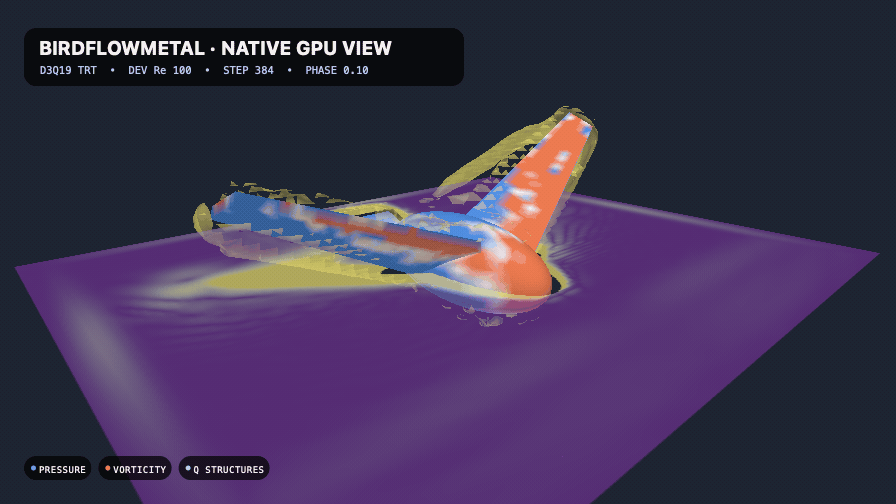
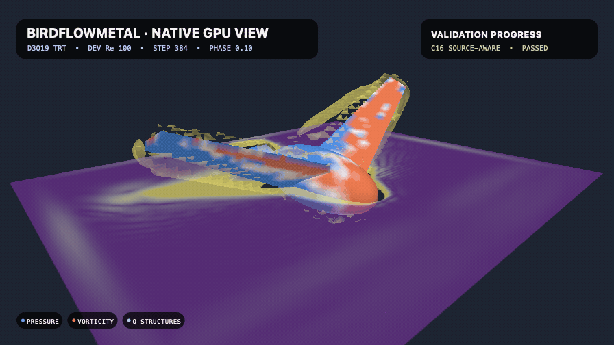

# BirdFlowMetal visual progress

This folder preserves each previously published README hero as an exact binary
from the commit that introduced it. The archive is presentation history, not
quantitative evidence; validation claims must cite the committed JSON artifacts
and an immutable Git commit.

## V1 — native fluid viewer

Commit: `85c806a` · 2026-07-15 · `896 × 504` · 40 frames · 20 fps

The first hero exposed the live D3Q19 viewer: surface pressure, a vorticity
slice, Q structures, and GPU-rendered diagnostics around the analytic bird.

## V2 — validation overlay

Commit: `99bc3a5` · 2026-07-15 · `896 × 504` · 40 frames · 20 fps

The native-fluid scene gained a compact validation-progress panel so numerical
status was visible in the animation rather than separated from it.

## V3 — measured-dove replay

Commit: `f174282` · 2026-07-16 · `1120 × 630` · 72 frames · 24 fps

The synthetic showcase was replaced by the source-locked Deetjen `OB_F03`
surface, measured/coarse-computed force history, component colors, and
kinematic wing ghosts. This revision used the earlier back-and-forth
presentation.

## V4 — continuous forward loop

Commit: `6f3dab2` · 2026-07-16 · `1120 × 630` · 72 frames · 24 fps

The replay stopped reversing. It advances monotonically through measured
samples 27–121 and uses a visibly labeled, velocity-matched 14 ms presentation
closure so the loop remains continuous without claiming periodic source data.

## V5 — D28 pre-roll frontier

Worktree snapshot: 2026-07-17 · `1120 × 630` · 72 frames · 24 fps

Lighting, hierarchy, body-following camera motion, dual-layer wingtip trails,
and the validation rail were refined. Its status was locked to the passed D28
RR3 production-margin pre-roll, with the full measured-force window still open.

SHA-256: `367010c6a2ea564d87fd6669edc56d2de196c9f478c208c59c45dab6eb74a499`

## V6 — D28 full-window frontier

Worktree snapshot: 2026-07-17 · `1120 × 630` · 72 frames · 24 fps

This exact binary locked the force chart and numerical status to the audited
D28 RR3 source-viscosity full window: 13,216 steps, 187 force bins, positive
populations, and closed momentum ledgers. D32 was still the open refinement
question.

SHA-256: `c27237257a49d0e0883fea7b32be9be23283eaafdee0a57d2baedfb2a4007dc2`

## V7 — D32 phase-localization frontier

Worktree snapshot: 2026-07-17 · `1120 × 630` · 72 frames · 24 fps

The first fine-grid hero locked the chart to the audited D32 full window,
reported the failed `5.632% > 5%` pair gate, and marked the independently
localized `25...30 ms` interval before its component replay existed.

SHA-256: `d7b511d170eeb4785487c08fae21a2e5c5d8ae4561819b1145648f0c96538147`

## Current hero

The [current README animation](../birdflow-metal-native-viewer.gif) keeps the
forward loop while improving silhouette lighting, visual hierarchy, camera
framing, dual-layer wingtip traces, file-size headroom, and validation status.
Its force chart remains artifact-locked to the independently audited D32 RR3
source-viscosity full window. The top status and new `TARGET AUDIT` rail node
are additionally locked to both exact-reproduction component cases and their
15-check attribution audit: reflected-population self energy supplies `58.4%`
of the absolute ledger. The amber chart band retains the audited `25...30 ms`
interval, while the boundary panel still reports the failed D28/D32
`5.632% > 5%` fine-pair gate. Convergence and experimental agreement therefore
remain explicitly open. The current encoding is `9,511,375` bytes with
SHA-256 `fdbf5533df6b06a3321aad31c338a97e0391ed296189003e34f0fab661fcbdaf`.
Its seam RGB mean absolute change is `1.550368`, only `0.701829x` the median
adjacent-frame change.
