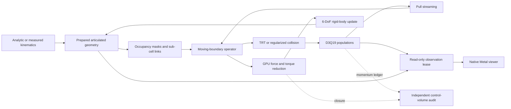

# BirdFlowMetal

<p align="center">
  <strong>A GPU-native, three-dimensional fluid–body laboratory for articulated bird flight on Apple silicon.</strong>
</p>

<p align="center">
  
  
  
  
  
</p>


<p align="center"><em>Native Metal rendering of the forward, body-following 27–121 ms repeated-pose interval, with a labeled 14 ms presentation-only closure for a continuous loop. Trails show surface kinematics, not CFD streamlines; the numerical gate passes while experimental refinement remains open at the declared 68.07× viscosity floor.</em></p>

BirdFlowMetal advances a real D3Q19 fluid state on the GPU, evaluates articulated moving boundaries, exchanges momentum with those boundaries, reduces aerodynamic force and torque, and can integrate a six-degree-of-freedom rigid body—all in one Swift/Metal package. It also includes a native scientific viewer, exact-input measured-motion replay, independent reference algebra, archived validation reports, and deliberately strict scientific acceptance gates.

> [!IMPORTANT]
> **Scientific status:** the coupled vertical slice is complete and the fixed-thickness prescribed flapping-wing canonical is quantitatively accepted. Complete measured-bird and free-flight results are **not** yet publication-ready. The repository keeps those boundaries explicit instead of converting engineering success into an aerodynamic claim.

[Quick start](#quick-start) · [Validation scoreboard](#validation-scoreboard) · [Native viewer](#native-metal-viewer) · [Architecture](#architecture) · [Measured data](#measured-geometry-and-kinematics) · [Scientific limits](#scientific-boundary) · [Full validation contract](Docs/VALIDATION.md)

## Why this project is interesting

- **One coupled stack:** fluid populations, articulated geometry, moving-wall treatment, topology changes, load extraction, and body dynamics live in one executable system.
- **GPU-resident science:** production stepping, geometry preparation, diagnostics, load reduction, Q criterion, marching cubes, pathlines, and rendering all use Metal.
- **Estimator-independent checks:** boundary loads close against fluid momentum storage and control-surface flux; free flight also closes direct fluid + body + wing momentum against far-field, sponge, and gravity impulse.
- **Negative results are first-class artifacts:** rejected operators, failed gates, source locks, phase histories, and exact thresholds are committed beside accepted results.
- **Measured-motion ready:** periodic left/right stroke, deviation, pitch, and twist are replayed with consistent pose and physical angular rates; exact input bytes and SHA-256 are retained.
- **No hosted macOS bill:** Swift and Metal validation is intentionally local. This repository contains no GitHub Actions workflows.

## Validation scoreboard

| Layer | Current result | Evidence |
|---|---|---|
| D3Q19 reference and production kernels | **Accepted engineering gate** | CPU/GPU early-step agreement, shear-wave convergence, mass tracking, batch invariance |
| Moving planar walls | **Accepted** | Couette and oscillating Stokes velocity/force/phase refinement |
| Topology-changing body | **Accepted** | 64 covered + 64 uncovered events; conservative force-budget RMS residual `3.64e-5` |
| Fixed sphere, Re=100 | **Accepted canonical** | drag, symmetry, torque leakage, refinement, batching |
| Fixed finite wing, Re=100 | **Accepted canonical** | finest `CL=0.76135`, `CD=0.70711`; two-finest changes below `3%` |
| Prescribed flapping wing | **Accepted canonical** | 20/24-cell fixed-thickness changes `1.904%` lift and `3.054%` drag; finest mean errors below `4%` |
| Native viewer | **Accepted engineering gate** | observation invariance, zero solver waits, Q/pressure/slice/pathline tests, exact checkpoint continuation |
| Measured-bird ingestion/replay | **Plumbing accepted; science open** | schema, provenance, interpolation, Mach/domain preflight, production-Metal replay |
| Measured dove external-force benchmark | **Full-window numerical pilot passed; refinement open** | both regularized BGK and RR3 remain positive through all 3,776 steps and differ by less than `0.9%`; coarse measured-force error is descriptive at `68.07x` source viscosity |
| Published-condition high-Re sphere | **Open** | RR3 clears numerical gates, but D=8 wake averaging remains statistically unresolved |
| Quantitative complete bird / free flight | **Solver gates implemented; same-specimen data blocked** | external-system momentum closes at `5.08e-5` relative RMS in the compact topology/gravity gate; schema-2 inertia, runtime aborts, and load/body ladders are ready; real complete specimen input is absent |

The most important accepted flapping result is committed as [`flapping-wing-fixed-thickness-acceptance.json`](ValidationArtifacts/flapping-wing-fixed-thickness-acceptance.json). The current high-Re open question is committed as [`measured-wing-stationary-wall-recursive-regularization-duration.json`](ValidationArtifacts/measured-wing-stationary-wall-recursive-regularization-duration.json).

The next experimental validation source is now qualified without weakening the
measured-data contract. Deetjen et al.'s Ringneck-dove deposit provides
synchronized processed 3D surfaces, kinematics, and measured horizontal and
vertical aerodynamic-force histories. The selected `OB` flight can be acquired
as a CRC-locked 15 MB engineering subset or a 671 MB subset including its full
surface instead of downloading the 19.3 GB archive. See
[`Docs/DEETJEN_DOVE_BENCHMARK.md`](Docs/DEETJEN_DOVE_BENCHMARK.md). Its inertia
remains modeled, so it advances prescribed-force validation—not measured
schema-2 free flight.

The decoded surface is now a committed 3.73 MB float32 sequence with one fixed
topology for the body, measured left wing, explicitly mirrored right wing, and
tail. It uses the deposited laboratory motion without an artificial periodic
wrap. The compact mesh stays 128 triangles below the current Metal identifier
limit. Independent CPU reconstruction passes every binary, topology, area,
coordinate-bound, and adjacent-frame wall-speed check; the exact artifacts are
[`manifest.json`](ValidationInputs/deetjen-ob-f03-surface-v1/manifest.json) and
[`deetjen-dove-surface-cpu-parity.json`](ValidationArtifacts/deetjen-dove-surface-cpu-parity.json).
The geometry-only Apple M4 replay then dispatches the generic indexed Metal
prepare/raster/resolve path for all 144 frames on a `59 x 53 x 50` grid. It
preserves all four components every frame, matches CPU occupancy exactly at five
milestones, and bounds wall-velocity and signed-distance differences by
`2.182e-5` lattice and `1.574e-5` cells. Five additional fractional-time probes
exercise interpolation between stored frames. The archived 7.02-second result is
[`deetjen-dove-indexed-metal-geometry.json`](ValidationArtifacts/deetjen-dove-indexed-metal-geometry.json).
It deliberately executes no collision or force kernel, so aerodynamic agreement
remains open.

The following production integration gate is deliberately short and isolated:
periodic boundaries and zero sponge leave the moving surface as the only fluid-
momentum source. In `0.24 s`, eight steps exercise 39 newly covered cells, 53
newly uncovered cells, and 101,262 persistent boundary links through the
production interpolated-link, conservative moving-domain force, and TRT fluid
kernels. Direct before/after fluid momentum closes against the recorded load at
`1.789e-5` relative RMS, with `3.8846e-8 kg m/s` maximum absolute residual.
Evidence is
[`deetjen-dove-indexed-production-coupling.json`](ValidationArtifacts/deetjen-dove-indexed-production-coupling.json).
This accepts coupling and impulse accounting, not developed flow or agreement
with the measured force platform.

The deposited force-processing and muscle-model scripts now close the last
input-side ambiguity independently. They establish that platform `FxWings`
maps to source world-forward `y`, both stored platform channels must be negated
to obtain force on the bird, and source world `[y,z]` maps to BirdFlow `[x,z]`.
The resulting measured target is therefore
`[-FxWings, unavailable, -FzWings]`; lateral force is deliberately absent, not
zero-filled. Nearest-sample registration and integer camera arithmetic agree
at all 144 surface frames, with 143 explicit half-frame interpolation samples
between them. The 287-sample target, source-code registration, and independent
committed-input audit are
[`deetjen-ob-f03-force-v1.json`](ValidationInputs/deetjen-ob-f03-force-v1.json),
[`deetjen-dove-force-registration.json`](ValidationArtifacts/deetjen-dove-force-registration.json),
and
[`deetjen-dove-force-target-cpu-parity.json`](ValidationArtifacts/deetjen-dove-force-target-cpu-parity.json).
This clears a coarse prescribed-motion pilot, not experimental agreement or
the refinement ladder.

That pilot is now executed and archived rather than silently tuned. It advances
the measured motion through nonperiodic far-field TRT at 16 fluid steps per
2 kHz force sample. The authors' analysis window is scored only from `0.025` to
`0.118 s` (187 samples), after a locked 800-step pre-roll. At the deliberately
coarse `0.01 m` grid, the source viscosity would require `tau+=0.50001469`,
below the single-precision guard, so the run uses a declared `tau+=0.501`
viscosity floor—`68.07x` the source viscosity—and applies no experimental-
agreement gate.

The Apple M4 pilot stops before comparison: the first sampled negative D3Q19
population occurs at step 176 (`5.5 ms`), direction 7, fluid cell
`[31,35,29]`, only `0.0764` cells from the surface; the load becomes nonfinite
at step 331. The independent artifact audit passes while the integration gate
fails. This is a useful negative result: force normalization, target sign, and
the scored window are not the immediate blocker. Evidence is
[`deetjen-dove-coarse-force-pilot.json`](ValidationArtifacts/deetjen-dove-coarse-force-pilot.json)
and
[`deetjen-dove-coarse-force-pilot-audit.json`](ValidationArtifacts/deetjen-dove-coarse-force-pilot-audit.json).
The fixed-input collision screen is now complete with population diagnostics at
every step. Production TRT first becomes negative at step 150 (`4.6875 ms`) in
the same direction-7 cell. Positivity-preserving regularized BGK and RR3 both
finish all 800 pre-roll steps with finite loads and positive populations.
Regularized BGK activates its convex correction in 55 cell-steps
(`2.013e-7` of all cell-steps); RR3 activates in 28 (`1.025e-7`). The archive
and independent audit are
[`deetjen-dove-collision-pre-roll-ab.json`](ValidationArtifacts/deetjen-dove-collision-pre-roll-ab.json)
and
[`deetjen-dove-collision-pre-roll-ab-audit.json`](ValidationArtifacts/deetjen-dove-collision-pre-roll-ab-audit.json).
Both candidates then replayed the same 800 steps with a fixed control surface
five cells outside the swept bird and outside the six-cell sponge. The
conservative load closed against independent momentum storage plus surface flux
at `0.07944%` relative RMS for regularized BGK and `0.07987%` for RR3. A second
whole-domain before/after fluid ledger, corrected only for measured far-field
and sponge impulse, closed at `0.11459%` and `0.11453%`. No solid crossed the
control surface. The complete histories and independently reconstructed
arithmetic are
[`deetjen-dove-collision-momentum-closure.json`](ValidationArtifacts/deetjen-dove-collision-momentum-closure.json)
and
[`deetjen-dove-collision-momentum-closure-audit.json`](ValidationArtifacts/deetjen-dove-collision-momentum-closure-audit.json).
Both candidates then completed the fixed 3,776-step extended pilot through all
187 registered comparison samples. Every-step diagnostics remained finite and
positive. Regularized BGK retained only 55 corrected cell-steps
(`4.265e-8` of all cell-steps), while RR3 retained 28 (`2.171e-8`). Their
phase histories are close: endpoint and interval-mean pairwise normalized RMS
differences are `0.656%` and `0.882%`. The archive and independent
reconstruction are
[`deetjen-dove-collision-extended-pilot.json`](ValidationArtifacts/deetjen-dove-collision-extended-pilot.json)
and
[`deetjen-dove-collision-extended-pilot-audit.json`](ValidationArtifacts/deetjen-dove-collision-extended-pilot-audit.json).
The endpoint measured-force errors (`5.665`/`5.676`) and interval errors
(`2.274`/`2.264`) are recorded but not acceptance gates because this grid uses
`68.07x` source viscosity. The subsequent fixed-physics D=8/D=12 discriminator
held physical domain, thickness, viscosity, Mach, geometry, timing, and gates
constant. Both operators cleared both grids; their trend scores were nearly
tied (`0.12545`/`0.12508`) and disagreement decreased from `0.882%` to
`0.816%`. The preregistered cross-canonical rule therefore selected RR3 and
authorized only its D=16 run. That completion stopped at step `751/7,552` on a
negative direction-0 population `0.215` cells from the surface while loads
remained finite. The negative result is independently audited; no second D=16
operator or unavailable force-convergence value was substituted.

The follow-up sparse provenance replay captures steps `747...751` at that cell
without modifying production state. Its duplicate stage algebra predicts every
actual RR3 direction-0 write bit-for-bit. At step 751, direction 0 is still
positive after reconstruction (`0.005964`), but moving-boundary reconstruction
has already made directions `2, 8, 12, 13, 16` negative. The resulting local
speed is `1.00746` lattice units (Mach `1.74497`), beyond the direction-0
equilibrium positivity limit `0.816497`. RR3's positivity scale collapses to
zero and collision writes the negative equilibrium `-0.00342597`; topology
refill, far field, and sponge are excluded. The archived capture and independent
RR3 reconstruction are
[`deetjen-dove-d16-population-stage-provenance.json`](ValidationArtifacts/deetjen-dove-d16-population-stage-provenance.json)
and
[`deetjen-dove-d16-population-stage-provenance-audit.json`](ValidationArtifacts/deetjen-dove-d16-population-stage-provenance-audit.json).

The next sparse replay decomposes all 17 moving-boundary directions at steps
750 and 751. It matches the stage archive within `1.892e-10` and closes every
reflected + auxiliary + wall sum within `1.747e-10`. The negative direction set
changes from `2, 3, 10` to `2, 8, 12, 13, 16`; at failure, all reflected
populations and auxiliary contributions are nonnegative, while the wall
correction is negative in all five. Four links are already halfway fallbacks,
and moving-wall halfway fixes none; removing the wall term makes all five
positive. This clears interpolation and inherited reflection as the primary
repair surface and isolates moving-wall correction admissibility. Evidence is
[`deetjen-dove-d16-boundary-term-decomposition.json`](ValidationArtifacts/deetjen-dove-d16-boundary-term-decomposition.json)
with its
[`independent audit`](ValidationArtifacts/deetjen-dove-d16-boundary-term-decomposition-audit.json).

The locked one-cell moving-wall discriminator then reuses those archives
without rerunning the fluid simulation. Scaling the wall correction by the
pre-step local density (`0.030193`, candidate A) removes all five negative
populations, leaves a `5.580e-5` minimum, and restores equilibrium
admissibility at lattice Mach `0.5482` without a positivity limiter. A
reference-density correction with a worst-link positivity scale (candidate B)
also survives, but requires an active global scale of `0.11505`. Candidate A
therefore advances only to a controlled force/momentum-ledger experiment; it
is not enabled in production. Evidence is
[`deetjen-dove-d16-moving-wall-admissibility-ab.json`](ValidationArtifacts/deetjen-dove-d16-moving-wall-admissibility-ab.json)
with its
[`independent audit`](ValidationArtifacts/deetjen-dove-d16-moving-wall-admissibility-ab-audit.json).

Candidate A has now passed its controlled D=16 production-ledger experiment.
On Apple M4 it completed the retained `751`-step failure horizon in `22.81 s`
on the unchanged `149 x 136 x 131` grid. The minimum population remained
positive at `1.634e-8`; the near-wing and global relative RMS force/momentum
residuals were `4.719e-4` and `5.306e-4`, respectively, against the locked
`0.005` limit. The control surface remained roughly 11 cells outside the swept
bird, no solid link crossed it, and the opt-in wall candidate used no wall
positivity limiter. Only two recursive-collision corrections occurred
(`1.003e-9` of cell-steps). Production still uses the reference-density wall
law: this result authorizes only a full registered-window D=16 candidate-A
run. Evidence is
[`deetjen-dove-d16-moving-wall-ledger.json`](ValidationArtifacts/deetjen-dove-d16-moving-wall-ledger.json)
with its independently reconstructed
[`nine-check audit`](ValidationArtifacts/deetjen-dove-d16-moving-wall-ledger-audit.json).

The source-locked full-window promotion also passes. Candidate A completes all
`7,552` D=16 steps in `293.34 s`, retains a positive `1.025e-8` minimum
population, and captures all 187 registered force samples. Near-wing and
global relative RMS residuals are `6.247e-4` and `8.312e-4`, still well below
`0.005`; only 34 RR3 corrections occur (`1.696e-9` of cell-steps), with no
wall limiter or production-default change. The descriptive two-component
force error is `2.1731` normalized RMS: stability and accounting are cleared,
but the fixed `68.07x` viscosity floor and absent candidate-specific spatial
refinement prohibit experimental agreement. Evidence is
[`deetjen-dove-d16-moving-wall-full-window.json`](ValidationArtifacts/deetjen-dove-d16-moving-wall-full-window.json)
and its independent
[`11-check audit`](ValidationArtifacts/deetjen-dove-d16-moving-wall-full-window-audit.json).

The preregistered candidate-A spatial discriminator is now complete—and it
honestly rejects clearance. Full-window D=8 and D=12 runs both pass positivity,
all 187 registered bins, and the independent near-wing/global ledgers; the
existing D=16 archive is reused byte-for-byte. Force-history change decreases
monotonically from `12.705%` (D8→D12) to `6.268%` (D12→D16), while fine-pair
mean and impulse differences are only `1.058%`. However, `6.268%` exceeds the
preregistered `5%` force-history limit, so spatial refinement and production
promotion remain blocked. The green independent audit authenticates this
locked rejection. Evidence is the
[`preregistration`](ValidationArtifacts/deetjen-dove-moving-wall-spatial-preregistration.json),
[`D8 case`](ValidationArtifacts/deetjen-dove-d8-moving-wall-full-window.json),
[`D12 case`](ValidationArtifacts/deetjen-dove-d12-moving-wall-full-window.json),
[`discriminator`](ValidationArtifacts/deetjen-dove-moving-wall-spatial-discriminator.json),
and [`independent audit`](ValidationArtifacts/deetjen-dove-moving-wall-spatial-discriminator-audit.json).

The zero-simulation phase localization rejects an immediate D=20 allocation.
The D12-to-D16 difference is mixed rather than a single event or smooth
distributed truncation: 27 of 187 bins carry half its squared difference,
the strongest 5 ms window carries only `16.81%`, yet normalized adjacent-bin
roughness is `1.351` and `50.27%` of non-DC spectral energy is high-frequency.
Topology correction explains only `12.62%`; near-wing/global ledger-residual
differences are only `0.375%/0.749%` of the force difference. Thus neither a
topology spike nor closure-accounting error explains the miss, but its rough
inter-grid structure is not evidence for smooth asymptotic convergence. See
the [`phase-localization artifact`](ValidationArtifacts/deetjen-dove-moving-wall-spatial-localization.json)
and [`independent audit`](ValidationArtifacts/deetjen-dove-moving-wall-spatial-localization-audit.json).

The source-locked lag/band discriminator then eliminates sub-bin force
registration as the dominant mechanism. The best global shift is only
`-0.02` force bins (`-10 us`), and five-fold held-out validation improves the
D12-to-D16 comparison by just `1.506%`. A nonperiodic 200 Hz low-pass reduces
the normalized difference from `6.268%` to `4.253%`, but retains only `74.27%`
of combined force energy against the frozen `99%` requirement. Filtering away
one quarter of the physical signal cannot be relabeled as convergence.
Neither broadband estimator noise nor coherent low-band grid bias is therefore
established; the result remains `mixed-unresolved`, the original `5%` raw gate
is unchanged, and D=20 remains blocked. The
[`lag/band artifact`](ValidationArtifacts/deetjen-dove-moving-wall-spatial-lag-band.json)
and [`11-check independent audit`](ValidationArtifacts/deetjen-dove-moving-wall-spatial-lag-band-audit.json)
make that negative result reproducible without another fluid simulation.

The follow-up fixed-geometry temporal canonical runs in `10.82 s` and removes
topology and evolving kinematics entirely. At the most discrepant archived
phase (`26.5 ms`), both D12 and D16 hold the same measured geometry and wall
velocity for eight 0.5 ms bins while recording every conservative-force
substep. Endpoint sampling differs by `19.587%`; sample-centered trapezoidal
and direct impulse-preserving aggregation reduce this to `9.760%` and
`9.487%`. Aggregation therefore removes `51.56%` of the endpoint disagreement,
but the authoritative impulse-preserving history still fails 5%. The complete
eight-bin impulses differ by only `0.864%`, both momentum ledgers pass below
`0.036%`, topology correction is exactly zero, and the independent 13-check
audit passes. Classification remains `mixed-unresolved`; the original raw
rejection and D20 block are unchanged. Evidence is the locked
[`preregistration`](ValidationArtifacts/deetjen-dove-moving-wall-temporal-sampling-preregistration.json),
[`Metal result`](ValidationArtifacts/deetjen-dove-moving-wall-temporal-sampling.json),
and [`independent audit`](ValidationArtifacts/deetjen-dove-moving-wall-temporal-sampling-audit.json).

The preregistered 24-bin extension rules out startup relaxation. Its
independent restart reproduces every original eight-bin vector exactly.
Impulse-preserving D12/D16 history differences are `9.487%`, `9.929%`, and
`9.961%` for the 8/16/24-bin prefixes; the three eight-bin blocks are
`9.487%`, `28.208%`, and `12.379%`. The late block is `30.48%` worse than the
first, while the full 24-bin cumulative impulse difference reaches `4.716%`.
Both 576/768-step cases retain positive populations, exact zero topology, and
sub-`0.069%` ledgers. The locked classification is therefore
`persistent-fixed-wall-grid-disagreement`: temporal aggregation matters, but
neither longer duration nor cumulative cancellation clears the force history.
The [`duration preregistration`](ValidationArtifacts/deetjen-dove-moving-wall-temporal-duration-preregistration.json),
[`24-bin Metal result`](ValidationArtifacts/deetjen-dove-moving-wall-temporal-duration.json),
and [`13-check independent audit`](ValidationArtifacts/deetjen-dove-moving-wall-temporal-duration-audit.json)
preserve that negative result. D20 and production promotion remain blocked.

The geometry-only follow-up completes in `4.99 s` on Apple M4 and enumerates
the exact production solid-to-fluid D3Q19 convention at the same `26.5 ms`
phase without allocating populations. Metal and the independent CPU raster
match every occupancy cell and every link count; force-relevant aggregate
parity is within `0.182%`. D12→D16 total link measure changes only `1.362%`,
the worst component changes `2.301%`, the 20-bin interpolation-fraction total
variation is `3.143%`, and the worst grid-to-grid mean wall-velocity change is
only `0.418%` of triangle-quadrature RMS. Area and interpolation therefore
clear. The left-wing deposited mean velocity does not: its independent
thickened-triangle error is `10.742%` at D12 and `10.379%` at D16 against the
frozen `10%` limit. The locked classification is
`wall-velocity-deposition-bias`; D20 remains blocked. The version-2 contract
also records why its pointwise CPU tolerance was corrected to the repository's
pre-existing geometry-parity envelope while adding a stricter `0.5%` complete
link-aggregate gate. Evidence is the
[`preregistration`](ValidationArtifacts/deetjen-dove-moving-wall-link-geometry-preregistration.json),
[`geometry-only result`](ValidationArtifacts/deetjen-dove-moving-wall-link-geometry.json),
and [`13-check independent audit`](ValidationArtifacts/deetjen-dove-moving-wall-link-geometry-audit.json).

The follow-up velocity-sampling A/B advances no fluid and completes in
`21.22 s`. It reproduces the archived production moments exactly, then tests
both endpoint-interpolated velocity and an exact same-component
triangle-barycentric velocity at every reconstructed link intersection.
Neither explains the left-wing miss: the exact candidate changes the worst
mean error from `10.742%` to `10.783%`, while endpoint interpolation worsens
it to `11.430%`. Instead, the link-location check exposes a maximum
offset-surface residual of `0.874` cell against the frozen `0.75`-cell limit
(`0.0696`-cell RMS still passes). The classification is therefore
`signed-distance-intersection-placement-bias`; no velocity repair or
production change is authorized. Evidence is the locked
[`A/B preregistration`](ValidationArtifacts/deetjen-dove-moving-wall-link-velocity-preregistration.json),
[`direction-resolved result`](ValidationArtifacts/deetjen-dove-moving-wall-link-velocity.json),
and [`13-check independent audit`](ValidationArtifacts/deetjen-dove-moving-wall-link-velocity-audit.json).

The preregistered outlier localizer then scans all `25,262` D12 and `45,514`
D16 links in `0.40 s`, again without populations or force evaluation. Only
`8` and `7` links exceed `0.75` cell—`0.0251%` and `0.0122%` of total link
measure. None is on a true mesh boundary; `7/8` and `7/7` lie within `0.25`
cell of another component's physical offset surface. Their dominant D3Q19
directions differ and contain only `25.0%`/`28.6%` of outlier measure, rejecting
a common stencil-direction association. The locked result is
`mesh-edge-or-component-junction-associated`, descriptively narrowed to
component junctions. It authorizes only an exact offset-surface ray-root A/B
on these 15 archived links. Evidence is the
[`localization preregistration`](ValidationArtifacts/deetjen-dove-moving-wall-link-intersection-preregistration.json),
[`per-link archive`](ValidationArtifacts/deetjen-dove-moving-wall-link-intersection.json),
and [`binary-mesh 13-check audit`](ValidationArtifacts/deetjen-dove-moving-wall-link-intersection-audit.json).

The exact ray-root A/B resolves those 15 links in `0.072 s`. Every solid/fluid
endpoint pair selects different nearest components, and every fluid endpoint
selects the previously recorded alternate component. Linear interpolation is
therefore blending two different surface-distance functions. Exact global-
union roots remain far from production: junction RMS shifts are `0.519` cell
on D12 and `0.943` on D16, with a `1.136`-cell maximum against the unchanged
`0.10` RMS/`0.75` maximum limits. D16's exact global roots are all the owner
roots, so its owner-to-union improvement is zero. Numerical roots close below
`7.0e-7` cell and a separate NumPy reconstruction agrees. The locked result is
`junction-global-root-linearization-bias`; no production change or fluid run
is authorized. Evidence is the
[`ray-root preregistration`](ValidationArtifacts/deetjen-dove-moving-wall-link-ray-root-preregistration.json),
[`15-link A/B`](ValidationArtifacts/deetjen-dove-moving-wall-link-ray-root.json),
and [`independent 13-check audit`](ValidationArtifacts/deetjen-dove-moving-wall-link-ray-root-audit.json).

The follow-on coefficient discriminator evaluates the exact production
interpolated-bounce-back algebra on those same 15 links in under `0.04 ms`,
without geometry search or populations. Replacing linear `q` with the exact
global-union `q` changes the `q=0.5` stencil branch on `3/8` D12 links and all
`7/7` D16 links. The measure-weighted coefficient-vector L1 change reaches
`1.723` on D12 and `2.782` on D16, with a `3.189` maximum against frozen
`0.10` RMS and `0.25` maximum limits. The independently reproduced result is
`branch-changing-coefficient-sensitive`. This historically cleared only the
narrow captured-population replay resolved immediately below; by itself it did
not establish a force correction or authorize production or D20. Evidence is the
[`coefficient preregistration`](ValidationArtifacts/deetjen-dove-moving-wall-link-coefficient-preregistration.json),
[`15-link coefficient archive`](ValidationArtifacts/deetjen-dove-moving-wall-link-coefficient.json),
and [`independent 12-check audit`](ValidationArtifacts/deetjen-dove-moving-wall-link-coefficient-audit.json).

The decisive follow-up captures the actual production primitives on all eight
D12 outliers at every one of the `576` fixed-phase steps: `4,608` link-step
records in `10.02 s`. The first diagnostic archive is intentionally retained:
it exposed four production halfway fallbacks and failed source reproduction
because it attempted a near-wall counterfactual where the required farther
fluid node was solid. Contract revision 2 preserves every `10%` local and `1%`
global materiality threshold while applying the same feasibility rule to exact
`q`. Only three links can actually change branches; one exact root must retain
halfway fallback. Production then reconstructs within `3.32e-9`, with zero
source-record mismatches, positive populations, and both momentum ledgers below
`5.94e-4` relative RMS.

The realized exact-`q` effect is small: `1.822%` population RMS, `1.094%`
outlier-force RMS, `0.1085%` of global force RMS, and `0.4428%` of global
impulse. A separate Python implementation rebuilds all populations, forces,
torques, step reductions, impulses, hashes, and the transparent revision with
all 12 checks passing. The locked classification is
`realized-population-insensitive`; it rejects a boundary-law A/B and D16 replay
for these sparse links and leaves production unchanged. Evidence is the
[`fallback-aware preregistration`](ValidationArtifacts/deetjen-dove-moving-wall-link-population-fallback-preregistration.json),
[`4,608-sample Metal archive`](ValidationArtifacts/deetjen-dove-moving-wall-link-population-fallback.json),
and [`independent audit`](ValidationArtifacts/deetjen-dove-moving-wall-link-population-fallback-audit.json).
The highest-ROI next experiment is therefore a distributed, full-link
component/direction/`q`-bin decomposition of reflected and moving-wall force
over the existing fixed-phase histories—not another sparse-root or D20 run.

## Latest high-Re result

<p align="center">
  
  
</p>

Recursive-regularized BGK keeps the D=8/12/16 stationary-sphere cases positive, source/force closed, and non-intrusive while correction decreases with refinement. Promotion is still blocked: `Cd = 1.32042, 0.93800, 1.04777` is non-monotonic and the D12→D16 change is `10.476%` against the unchanged `5%` gate.

The cheap ten-convective-time follow-up resolved half the ambiguity:

- D=12 is late-window stable: ninth→tenth change `4.543%`; fifth→tenth change `2.177%`.
- D=8 is not: ninth→tenth change `46.848%`; fifth→tenth change `29.219%`.
- Every positivity, conservation, force-budget, control-isolation, and correction gate still passes.

Therefore the next highest-ROI experiment is **D=8 only**: estimate its dominant shedding period, then report period-complete block means and uncertainty. That is more defensible—and far cheaper—than spending immediately on D=20 or treating adjacent one-convective-time windows as independent steady estimates.

## The force-accounting investigation

The prescribed-wing load error was once roughly fivefold. The repository now contains the full chain that found and corrected it:

1. **Load decomposition** showed cover/uncover topology impulse contributed only `0.47%` of mean lift and `2.90%` of mean drag; link exchange dominated.
2. **Conventional versus Galilean-invariant momentum exchange** changed mean loads by less than `1%`, ruling out the wall-frame correction as the main factor.
3. **Independent coefficient reconstruction** recovered the paper denominator exactly from equations and raw forces, ruling out a shared normalization multiplier.
4. **Link-numerator decomposition** localized the sensitivity to cancellation between reflected populations and moving-wall correction.
5. **Near-wing fluid momentum balance** gave `(CL, CD)=(1.18092, 2.04933)` while legacy boundary accumulation gave approximately `(7.51, 9.56)`.
6. **A conservative moving-domain estimator** closed that independent balance within `0.002511/0.000247` maximum phase residuals under a `0.005` gate.
7. **A translating-sphere topology canonical** improved RMS momentum closure by `22,020×` over the retired estimator and made the corrected estimator the production default.
8. **The promoted 20/24-cell flapping ladder** then passed mean-load, phase, symmetry, periodicity, vortex, batching, and grid-change gates without relaxing thresholds.

This sequence is summarized in [`Docs/VALIDATION.md`](Docs/VALIDATION.md); machine-readable ledgers live in [`ValidationArtifacts/`](ValidationArtifacts/).

## Architecture



The package is an original implementation. Its software organization adopts PyFR’s controller/resource/command-graph separation: physical types and reference algebra are isolated from Metal resource orchestration, pipeline states are compiled once per backend, and a fixed GPU command graph is encoded repeatedly. The numerical operators themselves are Metal-specific MSL.

### Per-step coupled path

```text
prepare articulated pose and physical wall velocity
update current and previous solid occupancy
pull-stream 19 populations per fluid cell
apply interpolated moving-boundary reconstruction
recover density, velocity, and isothermal pressure
apply TRT or selected regularized collision + far-field sponge
accumulate link exchange and cover/uncover momentum
reduce force and torque deterministically on the GPU
optionally integrate the rigid torso and orientation
publish a read-only field lease when visualization requests one
```

Newly uncovered nodes are refilled from a local moving-boundary equilibrium. Newly covered nodes contribute their population momentum conversion to the body load. Demonstration and schema-1 prescribed wings remain explicitly massless. Schema 2 instead requires bilateral measured wing mass properties; the GPU applies their phase-resolved internal-momentum reaction to the body and archives left/right hinge reactions.

## Metal engineering

The production path is structured for Apple unified memory and predictable command submission:

- direction-major population storage gives adjacent GPU threads adjacent cell access;
- articulated wing frames are prepared once per timestep rather than once per cell;
- conservative bounds cull expensive bird geometry work;
- measured periodic keyframes are sampled once per timestep with physical rates preserved;
- occupancy and part identity share compact byte masks;
- the first deterministic load reduction is fused into fluid threadgroups;
- prescribed-wing phase loads reduce into a compact cycle buffer without per-step CPU waits;
- sub-cell boundary fractions reuse dormant solid-node population slots instead of allocating a full-grid link buffer;
- command-buffer batches are queued without intermediate CPU waits;
- density and velocity are captured only for the final externally visible step;
- fixed cases skip unused body-integration and intermediate load work; and
- allocation preflight rejects grids exceeding per-buffer or recommended working-set limits before partial allocation.

Optimization is accepted only when numerical state, loads, body state, and validation thresholds remain unchanged. [`Docs/BUILD_REPORT.md`](Docs/BUILD_REPORT.md) records the exact verification boundary and measured host timings.

## Native Metal viewer

```bash
swift run -c release birdflow-viewer
```

The same-process macOS viewer includes:

- pressure or `Cp` on the articulated body;
- arbitrary oblique slices with velocity, normal velocity, or vorticity;
- live world/velocity/vorticity probes and in-plane glyphs;
- RK2 pathlines with CFL subdivision and discontinuity reset;
- physical-unit vorticity and Q criterion;
- GPU classic marching cubes with capacity-safe indirect drawing;
- force, torque, body pose, solver time, render time, dropped-frame, and Q-capacity HUDs;
- versioned run bundles, derived-field keyframes, and exact compressed solver checkpoints.

Visualization receives only completed read-only field leases. Three best-effort slots prevent rendering from waiting the solver; if all slots are busy, the frame is dropped. The standalone compact M4 benchmark recorded `751.4 step/s` without observation and `643.2 step/s` with active offscreen rendering—`14.4%` ordinary GPU contention, zero visualization solver waits, and zero dropped frames.

Regenerate the hero GIF locally:

```bash
./Scripts/capture-readme-gif.sh
```

See [`Docs/VIEWER.md`](Docs/VIEWER.md) for controls, persistence formats, numerical separation, and verification.

## Quick start

### Requirements

- Apple-silicon Mac
- macOS 14 or later
- Xcode command-line tools with Metal compiler support
- Swift 6 or later
- Python 3 with NumPy and Matplotlib for reference/audit plots

### Build and run the local gates

```bash
swift build -c release
swift test -c release
./Scripts/check-metal.sh
python3 Scripts/static-audit.py
./Scripts/validate.sh
```

`check-metal.sh` invokes Apple’s offline compiler on both Metal libraries. `validate.sh` adds the independent reference cases and core production-Metal canonicals. Expensive flapping and high-Re refinement ladders remain explicit commands rather than surprise work inside every local check.

> [!NOTE]
> Validation is local-only. There are intentionally no GitHub Actions workflows, so pushes and pull requests do not consume hosted macOS CI minutes.

Latest recorded local run on Apple M4 (2026-07-16): **88 tests passed in 805.564 seconds**, followed by a successful release build, the independent physical-condition verifier, static Swift/MSL layout audit, and offline compilation of both Metal libraries.

## Run the solver

Fixed bird in an incoming stream:

```bash
swift run -c release birdflow \
  --steps 4096 \
  --report-every 128 \
  --reynolds 2000 \
  --reference-speed 8 \
  --lattice-speed 0.04
```

Free flight in initially stationary air:

```bash
swift run -c release birdflow \
  --free-flight \
  --steps 4096 \
  --report-every 128
```

Physical-domain-preserving refinement:

```bash
swift run -c release birdflow \
  --resolution-scale 2 \
  --steps 8192 \
  --report-every 256
```

`--resolution-scale N` multiplies grid dimensions, chord resolution, and sponge width by `N`, reducing `dx` and `dt` by `N`. Multiply the step count by `N` to compare the same physical duration. The executable emits CSV with time, body pose, linear velocity, aerodynamic force, and aerodynamic torque.

## Canonical validation commands

```bash
# Periodic shear-wave decay and convergence
swift run -c release birdflow validate shear-wave --resolution 32 --json

# Couette + oscillating Stokes moving walls
swift run -c release birdflow validate moving-wall --resolution 32 --json

# Topology-changing translating sphere and momentum closure
swift run -c release birdflow validate translating-body --json

# Re=100 fixed sphere
swift run -c release birdflow validate sphere --resolution 160 --json

# Re=100 aspect-ratio-2 fixed finite wing
swift run -c release birdflow validate wing --resolution 400 --json

# Published prescribed-wing input/geometry audit
swift run birdflow validate flapping-wing --audit-inputs --chord-cells 16 --json

# Published prescribed-wing production solve
swift run -c release birdflow validate flapping-wing --chord-cells 16 --json

# Current high-Re RR3 coarse-grid duration diagnostic
.build/release/birdflow validate translating-body \
  --high-re-stability --fixed-occupancy --stationary-wall \
  --recursive-regularization-duration --json
```

The fixed sphere and fixed wing are compact engineering canonicals, not substitutes for publication-scale domain and resolution studies. The accepted prescribed-wing composite is independently audited by:

```bash
python3 Scripts/audit-flapping-refinement.py
python3 Scripts/verify-measured-wing-physical-condition.py
```

## Measured geometry and kinematics

Audit a specimen input without allocating Metal resources:

```bash
.build/release/birdflow replay measured-bird \
  --input /path/to/specimen.json \
  --chord-cells 12 \
  --audit-only \
  --json
```

Replay prescribed motion and retain exact-input provenance plus phase loads:

```bash
.build/release/birdflow replay measured-bird \
  --input /path/to/specimen.json \
  --chord-cells 12 \
  --cycles 5 \
  --archive /path/to/specimen-replay-c12 \
  --json
```

Schema 1 requires SI units, source provenance, a COM-centered principal-axis frame, domain conditions, morphometrics, and independent left/right periodic pose and rate histories. Schema 2 adds measured bilateral wing mass, hinge-relative COM, inertia, and explicit whole-bird mass definitions for free flight. Cubic-Hermite interpolation keeps pose and wall velocity consistent. Preflight rejects invalid phase coverage, domain/sponge collisions, under-resolved thickness, and excessive estimated lattice Mach before Metal allocation.

The bundled complete-bird JSON is a **synthetic conformance fixture**, not a measured specimen. The measured right-wing surface tier is also intentionally wing-only. Read [`Docs/MEASURED_BIRD_DATA.md`](Docs/MEASURED_BIRD_DATA.md) before interpreting any replay.

For a same-specimen schema-2 input, `--load-refinement` runs the locked
five-cycle `8/12/16` load ladder and `--body-refinement --steps N` runs the
same-fluid `1/2/4` body-substep ladder. Free flight records bilateral inertial
hinge reactions and aborts on the first GPU-recorded Mach, clearance, or
non-finite-state event. Add `--momentum-ledger` to a free-flight replay to
archive direct population/body/wing momentum, far-field and sponge sources,
gravity, persistent-link exchange, inferred topology conversion, and both
locked `0.5%` closure gates. `--part-loads` additionally makes that intent
explicit and archives conservative body/left-wing/right-wing/tail loads,
aerodynamic hinge torque, prescribed-wing inertial reaction, required actuator
torque, and signed mechanical power:

```bash
.build/release/birdflow replay measured-bird \
  --input /path/to/schema-2-specimen.json \
  --chord-cells 12 --steps 100 --body-substeps 4 \
  --part-loads --archive /path/to/free-flight-ledger --json
```

For deliberately symmetric input, add `--expect-bilateral-symmetry` to apply
the locked `2%` mirrored force, hinge-torque, and actuator-power gate. It is
opt-in because measured left/right asymmetry can be physical.

For a schema-2 forward-flight specimen with nonzero freestream,
`--trim-search` performs a bounded body-pitch/airspeed Gauss-Newton search. It
uses two-cycle candidates at the requested screening grid, then reruns only the
selected point for at least five cycles before applying the unchanged `5%`
force, moment, and stationarity gates:

```bash
.build/release/birdflow replay measured-bird \
  --input /path/to/schema-2-specimen.json \
  --chord-cells 8 --trim-search --trim-iterations 2 \
  --archive /path/to/trim-search --json
```

The archive retains the byte-identical base input, every candidate result, and
the exact derived best-candidate JSON. Speed and Reynolds number scale together
so physical viscosity is unchanged; measured geometry and wing kinematics are
never tuned. A passing prescribed trim search is still not free-flight
boundedness or grid/body-step acceptance. Hover trim is rejected until the
input declares a physical aerodynamic control variable.

Use that archive's exact selected input for the combined confirmation gate:

```bash
.build/release/birdflow replay measured-bird \
  --input /path/to/trim-search/best-candidate-input.json \
  --chord-cells 8 --free-flight-confirmation \
  --archive /path/to/free-flight-confirmation --json
```

The command starts three independent experiments from the same input: a
minimum five-cycle, four-body-substep free-flight trajectory; a one-cycle
`1/2/4` body-step ladder; and a one-cycle coupled momentum/per-part load audit.
The trajectory must remain within `0.10` chord position drift, `0.05` reference
speed, `5 deg` attitude change, and `0.05` cycle-scaled angular velocity while
also passing runtime, refinement, `0.5%` momentum, and `0.5%` part-sum gates.
Its atomic archive includes the byte-identical input, trajectory CSV, and every
nested report. These are solver boundedness thresholds, not a universal claim
about biological maneuver amplitude or passive stability.

The diagnostic is opt-in and lazily allocates only compact reduction buffers;
normal batched solver/viewer throughput is unchanged. The current missing-data decision is retained in
[`ValidationArtifacts/quantitative-complete-bird-readiness.json`](ValidationArtifacts/quantitative-complete-bird-readiness.json).

## Scientific boundary

BirdFlowMetal targets low-Mach flapping flight and wakes using an isothermal weakly compressible formulation, a uniform Cartesian grid, rigid surfaces, moving occupancy masks, and sub-cell link placement in the prescribed beta-wing benchmark.

Quantitative complete-bird claims still require:

- an actual measured specimen with body, both wings, tail, mass properties, geometry provenance, and synchronized kinematics;
- a surface representation appropriate to the measured feather/wing geometry;
- passing the five-cycle `8/12/16` measured-bird load ladder;
- a passing five-cycle-confirmed prescribed trim search at the declared flight
  condition, followed by the archived `--free-flight-confirmation` gate;
- a passing archived per-part load/actuator report on that specimen, with the
  bilateral symmetry gate enabled only when its input is intentionally
  symmetric;
- a confirmation trajectory that stays inside the declared boundedness and
  per-step Mach/sponge/domain abort bounds, plus its independently restarted
  coupled-momentum/per-part and `1/2/4` rigid-body substep runs;
- same-specimen schema-2 wing inertia and a passing archived hinge-reaction
  treatment (or a separately justified massless-wing scientific model);
- forced channel-flow coverage and any turbulence/flexibility model required by the target regime.

The high-Re stationary-sphere RR3 branch is a collision-operator research gate. It is **not enabled** in flapping or measured-bird replay while its force statistic is unresolved. The accepted prescribed flapping benchmark validates the production moving-boundary/load path; it does not magically validate arbitrary complete-bird morphology or free-flight physics.

## Repository map

```text
Sources/BirdFlowCore/
  D3Q19.swift                       lattice and host reference algebra
  SimulationConfiguration.swift    physical/lattice scaling and guards
  BirdModel.swift                   morphology and articulated kinematics
  RigidBody.swift                   six-degree-of-freedom CPU reference

Sources/BirdFlowMetal/
  BirdFlowSimulation.swift          GPU state and command graph
  MetalBackend.swift                device, pipelines, resource setup
  Metal*Validation.swift            production-kernel canonical harnesses
  GPUData.swift                     Swift/MSL-compatible layouts
  Metal/BirdFlow.metal              fluid, boundary, reduction, body kernels

Sources/BirdFlowVisualization/
  ...                               read-only field diagnostics and renderer
  Metal/Visualization.metal         Q, slices, pathlines, marching cubes

Sources/BirdFlowViewerApp/           native SwiftUI/MetalKit macOS viewer
Reference/                           independent numerical references
Scripts/                             local audits, plotting, capture, gates
ValidationArtifacts/                exact machine-readable scientific record
ValidationInputs/                   locked input fixtures and provenance
Docs/                                numerics, validation, viewer, data contract
```

Start with [`Docs/NUMERICS.md`](Docs/NUMERICS.md) for equations, [`Docs/VALIDATION.md`](Docs/VALIDATION.md) for acceptance logic, and [`Docs/BUILD_REPORT.md`](Docs/BUILD_REPORT.md) for what has actually been verified.

## Published anchors and data qualification

- Fixed-wing comparison: [Taira and Colonius, *Journal of Fluid Mechanics* (2009)](https://authors.library.caltech.edu/records/frnmk-28536).
- Measured hummingbird right-wing surface: [Maeda et al., *Royal Society Open Science* (2017), DOI 10.1098/rsos.170307](https://doi.org/10.1098/rsos.170307), deposited grid [DOI 10.6084/m9.figshare.5406124.v1](https://doi.org/10.6084/m9.figshare.5406124.v1), CC BY 4.0.
- Prescribed numerical comparison: [Dong et al., *Insects* (2022), DOI 10.3390/insects13050459](https://doi.org/10.3390/insects13050459).
- Synchronized dove geometry/kinematics/force candidate: [Deetjen et al., *eLife* (2024), DOI 10.7554/eLife.89968](https://doi.org/10.7554/eLife.89968), deposited data [DOI 10.5061/dryad.wwpzgmsqs](https://doi.org/10.5061/dryad.wwpzgmsqs), CC0 1.0.
- The checked Song et al. Dryad archive [DOI 10.5061/dryad.8ch1b](https://doi.org/10.5061/dryad.8ch1b) is retained only as reference-curve material; it does not contain a complete reconstructed bird mesh.

[`measured-wing-source-audit.json`](ValidationArtifacts/measured-wing-source-audit.json) locks source filenames, licenses, MD5/SHA-256 digests, coordinate registration, scale reconstruction, surface-area closure, and the fields still missing for complete-bird replay.
The follow-up [`same-specimen source-gap audit`](ValidationArtifacts/maeda-same-specimen-source-gap-audit.json)
enumerates the complete public Maeda collection and separates potentially
recoverable author/zoo records from measurements that likely require a new
campaign. A concise, ready-to-send availability inquiry is in
[`Docs/SAME_SPECIMEN_DATA_REQUEST.md`](Docs/SAME_SPECIMEN_DATA_REQUEST.md).
The independent
[`Deetjen dove source qualification`](ValidationArtifacts/deetjen-dove-source-qualification.json)
selects one bounded prescribed-force benchmark, locks its remote Zip64 members,
and separates measured force channels from modeled lateral force and inertia.
The follow-up
[`engineering ingestion audit`](ValidationArtifacts/deetjen-dove-engineering-ingestion.json)
CRC/SHA-verifies the selectively acquired nine-member flight, reconstructs the
1000/2000 Hz synchronization, and inventories the real body/wing/tail surfaces.
The follow-up force-registration artifact locks the two deposited processing
scripts, the exact 287-sample BirdFlow force target, and the explicit
unavailable lateral component. The coarse pilot then localizes a near-wall
population-stability failure before the comparison window; experimental CFD
agreement remains open.

## Reproducibility and citation

Validation artifacts are versioned JSON, figures are generated from those artifacts, and source-lock chains make stale provenance detectable. For academic discussion before a formal release DOI exists, cite the repository URL plus an immutable Git commit and name the exact artifact used. Do not cite a screenshot, GIF, branch name, or unarchived console result as quantitative evidence.

## License

BSD-3-Clause. See [`LICENSE`](LICENSE).
