# BirdFlowMetal

<p align="center">
  <strong>A GPU-native, three-dimensional fluid–body laboratory for articulated bird flight on Apple silicon.</strong>
</p>

<p align="center">
  
  
  
  
  
</p>


<p align="center"><em>Native Metal rendering of the forward, body-following 27–121 ms repeated-pose interval, with a labeled 14 ms presentation-only closure for a continuous loop. Trails show surface kinematics, not CFD streamlines. The overlay is SHA-locked through the audited D32 RR3 window, selected-link provenance, the exact zero-fluid six-factor Shapley discriminator, and complete-dove direction censuses through all 11 D28/D32 samples from 25–30 ms. The worst fine-pair whole-surface direction-histogram change is 0.0783% and maximum whole fixed-profile response change is 0.00324%. The D28/D32 force-history change remains 5.632% against the frozen 5% limit, so force-bearing wall/interpolation interaction, grid convergence, and experimental agreement remain open.</em></p>

<p align="center"><a href="Docs/Media/Progress/README.md">Explore the visual progress archive →</a></p>

BirdFlowMetal advances a real D3Q19 fluid state on the GPU, evaluates articulated moving boundaries, exchanges momentum with those boundaries, reduces aerodynamic force and torque, and can integrate a six-degree-of-freedom rigid body—all in one Swift/Metal package. It also includes a native scientific viewer, exact-input measured-motion replay, independent reference algebra, archived validation reports, and deliberately strict scientific acceptance gates.

> [!IMPORTANT]
> **Scientific status:** the coupled vertical slice is complete and the fixed-thickness prescribed flapping-wing canonical is quantitatively accepted. Complete measured-bird and free-flight results are **not** yet publication-ready. The repository keeps those boundaries explicit instead of converting engineering success into an aerodynamic claim.

[Quick start](#quick-start) · [Validation scoreboard](#validation-scoreboard) · [Native viewer](#native-metal-viewer) · [Architecture](#architecture) · [Measured data](#measured-geometry-and-kinematics) · [Scientific limits](#scientific-boundary) · [Full validation contract](Docs/VALIDATION.md)

## Why this project is interesting

- **One coupled stack:** fluid populations, articulated geometry, moving-wall treatment, topology changes, load extraction, and body dynamics live in one executable system.
- **GPU-resident science:** production stepping, geometry preparation, diagnostics, load reduction, Q criterion, marching cubes, pathlines, and rendering all use Metal.
- **Estimator-independent checks:** boundary loads close against fluid momentum storage and control-surface flux; free flight also closes direct fluid + body + wing momentum against far-field, sponge, and gravity impulse.
- **Negative results are first-class artifacts:** rejected operators, failed gates, source locks, phase histories, and exact thresholds are committed beside accepted results.
- **Measured-motion ready:** periodic left/right stroke, deviation, pitch, and twist are replayed with consistent pose and physical angular rates; exact input bytes and SHA-256 are retained.
- **No hosted macOS bill:** Swift and Metal validation is intentionally local. This repository contains no GitHub Actions workflows.

## Validation scoreboard

| Layer | Current result | Evidence |
|---|---|---|
| D3Q19 reference and production kernels | **Accepted engineering gate** | CPU/GPU early-step agreement, shear-wave convergence, mass tracking, batch invariance |
| Moving planar walls | **Accepted** | Couette and oscillating Stokes velocity/force/phase refinement |
| Topology-changing body | **Accepted** | 64 covered + 64 uncovered events; conservative force-budget RMS residual `3.64e-5`; field-capture invariance regression is sub-second locally |
| Fixed sphere, Re=100 | **Accepted canonical** | drag, symmetry, torque leakage, refinement, batching |
| Fixed finite wing, Re=100 | **Accepted canonical** | finest `CL=0.76135`, `CD=0.70711`; two-finest changes below `3%` |
| Prescribed flapping wing | **Accepted canonical** | 20/24-cell fixed-thickness changes `1.904%` lift and `3.054%` drag; finest mean errors below `4%` |
| Formation Flight Observatory | **Coupling/accounting accepted; three-phase source mean remains mixed; power study blocked** | Three deterministic c16/c18/c20 source phases have only `1.384%` maximum profile spread, but their mean h-linear curvature is `0.596 > 0.5`; all nine cases pass and the independent audit is `190/190` |
| Native viewer | **Accepted engineering gate** | observation invariance, zero solver waits, Q/pressure/slice/pathline tests, exact checkpoint continuation |
| Measured-bird ingestion/replay | **Plumbing accepted; science open** | schema, provenance, interpolation, Mach/domain preflight, production-Metal replay |
| Measured dove external-force benchmark | **D28 and D32 numerically passed; fine pair not stabilized** | D32 RR3 completed all 15,104 steps and 187 registered bins; planar weighting plus D12/D16 and D28/D32 complete-dove direction censuses clear static direction redistribution at the locked 26.5 ms phase with exact Metal/CPU parity; force-history change remains `5.632%` against `5%`, so the full localized phase window, force-bearing wall/interpolation interaction, convergence, and experimental agreement remain open |
| Published-condition high-Re sphere | **Open** | RR3 clears numerical gates, but D=8 wake averaging remains statistically unresolved |
| Quantitative complete bird / free flight | **Solver gates implemented; same-specimen data blocked** | external-system momentum closes at `5.08e-5` relative RMS in the compact topology/gravity gate; schema-2 inertia, runtime aborts, and load/body ladders are ready; real complete specimen input is absent |

The most important accepted flapping result is committed as [`flapping-wing-fixed-thickness-acceptance.json`](ValidationArtifacts/flapping-wing-fixed-thickness-acceptance.json). The current high-Re open question is committed as [`measured-wing-stationary-wall-recursive-regularization-duration.json`](ValidationArtifacts/measured-wing-stationary-wall-recursive-regularization-duration.json).

## Formation Flight Observatory


BirdFlowMetal can now place a leader and follower in the same D3Q19 fluid,
assign each an independent wingbeat phase, and resolve force, root torque, and
actuator power per flyer. The first gate uses two copies of the accepted
prescribed hovering-wing canonical, so it studies multi-body wake interaction
without waiting for another bird dataset. The cinematic native Metal view uses
two phase-shifted copies of the locked Deetjen OB F03 measured-derived complete
dove surface: `2,157` vertices and `3,968` triangles per flyer over source
frames `27...121`, followed by a velocity-matched `14 ms` presentation closure.
The intentional `Δφ=0.25` leader/follower offset remains. V9 renders no HUD,
label, or text panel and moves the camera through a smooth spherical
figure-eight: one yaw cycle and two smaller pitch lobes expose multiple upper,
lower, and side-quarter views without losing either bird or breaking the loop.

The new living wake bridge is evidence-bound. Three ridges follow vorticity and
vertical velocity from the archived c20 fields; cyan-to-violet color encodes
wake age, while luminance follows all `4,820` samples of the passed c18 leader
`q5 [0,0,+1]` reflected-population trace. A small follower-plane ring is only a
presentation locator. All `48/48` phases keep the field at full opacity, with
cyclic linear interpolation between adjacent members of the 21-state c20
archive to remove visual stepping. That interpolation is for presentation
continuity only and is never used for forces, power, or validation. V9 also
removes the misleading diagonal dark seam left by the hidden canonical solid
mask and low-vorticity centerline: a mask-aware Gaussian display filter fills
only that invisible solid gap from surrounding archived fluid samples, while
joint vorticity/vertical-velocity opacity keeps the blue jet continuous. These
are presentation transforms; the archived c20 arrays remain unchanged.

The dove surfaces, wingtip guides, wake ridges, and marker do not enter
voxelization or fluid stepping; archived CFD and loads remain the prescribed
wing canonical. The right wing remains a documented bilateral-reflection
assumption and the tail retains its bounded presentation scale. The original
scientific stop is unchanged: c16-to-c20 force change is `10.68%` against a
frozen `5%` limit, while source curvature remains mixed at `0.884`. The
48-frame forward-only loop is pixel-seamless, its encoded seam is `0.960x` the
median adjacent-frame change, and the expanded deterministic visual audit
passes `57/57` checks while keeping quantitative formation benefit and
biological claims fail-closed.

```bash
swift run birdflow validate formation-flight \
  --chord-cells 8 --cycles 3 \
  --offset-z -4 --phase-offset 0.25 \
  --archive ValidationArtifacts/formation-flight-c8-z4-phase025
```

Every coupled case runs matched leader-only and follower-only controls. Mean
positive actuator power is the primary energy measure, and the run fails if
the wings overlap or if the two owner loads do not close to the unchanged
production solver total. The three-cycle c8 `z/c=-4`, `Δφ=0.25` case closes
force at `4.65e-7` and torque at `6.10e-6` in cycle-global relative L-infinity
norm, with zero overlapping voxels. The follower uses `3.69%` less mean positive
power than its matched isolated control, while the two-flyer system uses `2.14%`
less. The last-two-cycle power difference is `10.26%`, below the frozen `20%`
coarse-screen limit. This is an interaction hypothesis; the completed 12/16-cell
promotion below tests refinement and does not clear it. The preregistered
eight-case quick screen is
now complete: all cells pass, savings span `1.21%...7.91%`, and the strongest
cell is `z/c=-3`, `Δφ=0.25` with a `4.56%` two-flyer system reduction. Because
no c8 cell produced a penalty, the frozen largest-penalty selector honestly
collapses to the smallest-saving `1.21%` cell rather than manufacturing a
negative control.
The selected five-cycle c16 extrema now complete the preregistered
discriminator. Maximum/minimum savings are `11.916%`/`3.738%`, with final-cycle
power differences of `2.34%`/`2.83%`, zero overlap, and owner closure below
`1.3e-6` force and `4.3e-6` torque. The c16 best-minus-minimum contrast is
`8.178` percentage points. That is `1.519` points (`18.57%`) above c12, while
the maximum itself changes `18.77%` from c12 to c16. The solver and accounting
are cleared, but neither the absolute interaction magnitude nor its phase
contrast is grid-converged; no quantitative formation-benefit claim is made.

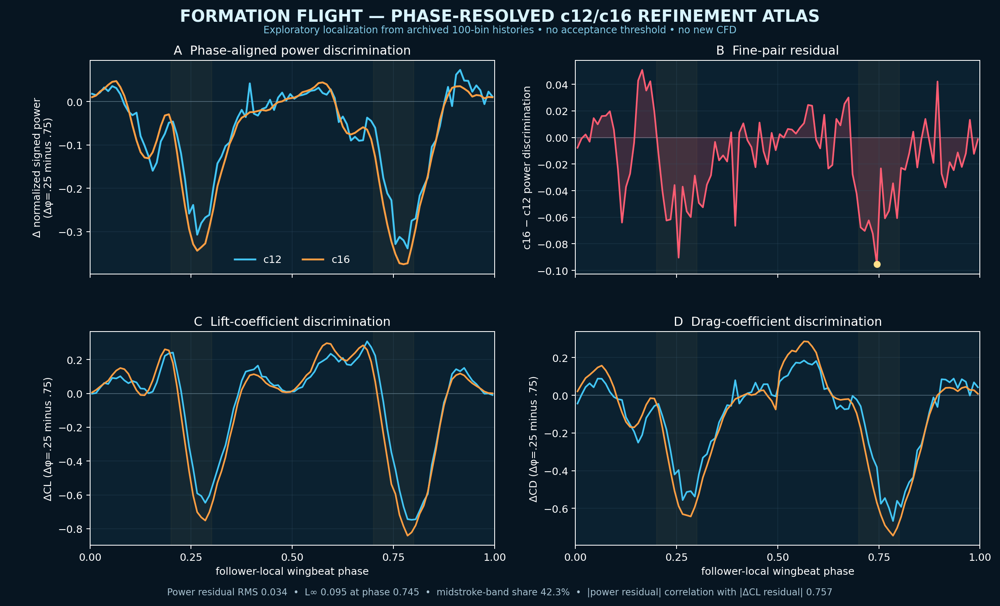

The archived phase histories localize why the fine pair remains open without
running more CFD. The normalized power-discrimination residual peaks at
follower phase `0.745`; just 21 of 100 bins carry half its absolute magnitude,
and the fixed quarter/three-quarter-cycle midstroke neighborhoods carry
`42.3%`. Its absolute magnitude correlates with the lift and drag residuals at
`0.757`/`0.760`, pointing to a phase-localized aerodynamic refinement problem
rather than a scalar normalization artifact.

A separate audit confirms that the acceptance checks do not mutate or clamp
solver output. The promoted reports have `36.5x` conservation headroom and
`7.07x` final-cycle repeatability headroom. Fixed upper bounds at 24
cells/chord, 20 cycles, and 12 chord offsets have been removed: device memory,
checked arithmetic, and exact representability now determine the feasible
study size. Physical validity and conservation checks remain intact.

The preregistered c20 maximum-selector measurement is now complete. Saving
increases from `11.916%` at c16 to `13.341%` at c20, a `10.68%` fine-pair
change against the frozen `5%` continuation limit. Every solver gate passes:
zero overlap, `7.17e-7` force closure, `4.42e-6` torque closure, and `2.366%`
cycle repeatability. The failure is therefore unresolved grid dependence, not
accounting or stationarity. The sequential rule stops the c20 minimum run and
saves another roughly two hours while retaining the negative result.

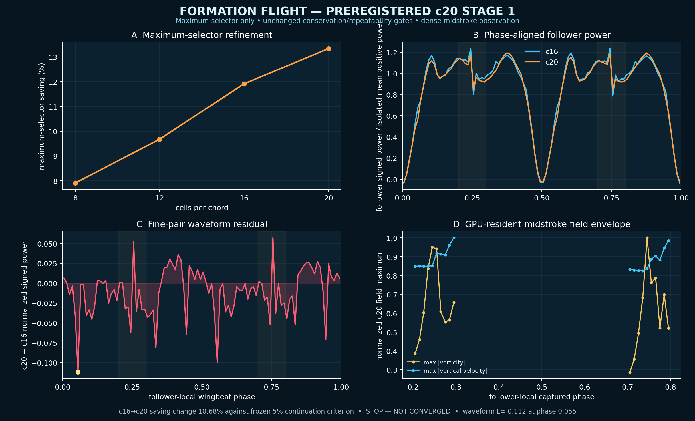

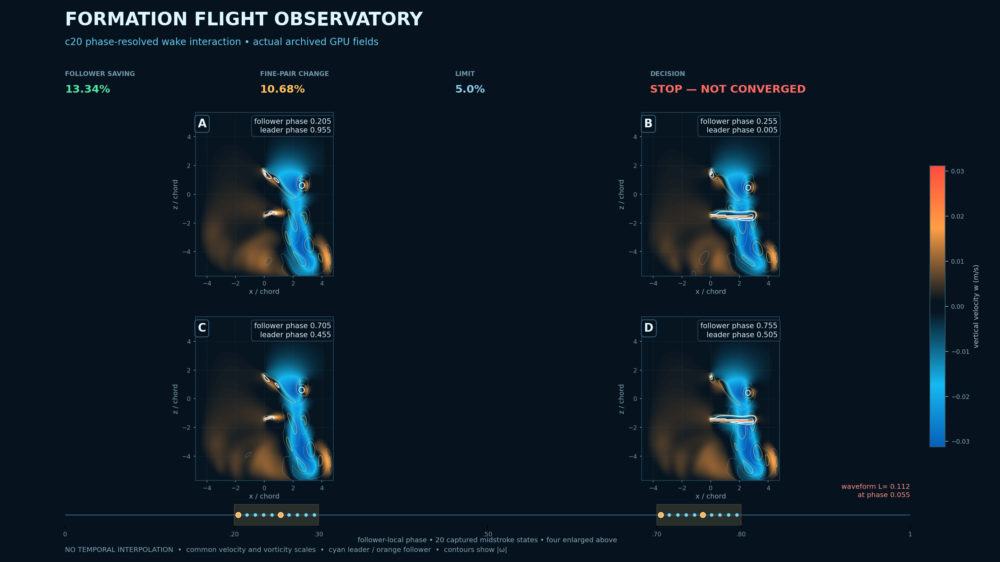

The phase plate enlarges four of the archived GPU fields with a common signed
vertical-velocity scale and common vorticity contour levels. Cyan and orange
show the leader and follower ownership masks. The phase rail shows all 20
requested midstroke captures; no temporal interpolation is used. This makes
the wake topology visually inspectable without weakening the negative
convergence result.

Twenty compact GPU-resident field captures cover the diagnosed
follower-midstroke bands without changing populations or loads. The
capture-on/off smoke is report-identical and agrees with the previous CPU
vorticity extraction to `1e-9` maximum absolute difference. All 21 c20 slices
are finite, indexed by both leader and follower-local phase, and SHA-locked by
the discriminator summary. Quantitative formation benefit remains
unauthorized.

The c16/c20 normalized power-waveform residual peaks at follower phase `0.055`
with magnitude `0.112`; only `23.15%` lies in the earlier midstroke bands and
its absolute magnitude tracks drag residual (`r=0.683`) rather than lift.
This redirects the next diagnostic toward an early-cycle coupled-only field
comparison instead of another full refinement ladder.

That preregistered early-cycle comparison is now complete. A fail-closed field
replay runs only the coupled case, but accepts its fields only if the exact
configuration, grid, cycle length, owner closure, periodicity, and complete
100-bin coupled history reproduce a passed full report. Both c16 and c20
histories reproduce exactly. Their combined runtime falls from `9139.12 s` to
`3861.10 s`—a measured `2.37x` speedup saving `87.97 min` without reducing
cycles or field phases.

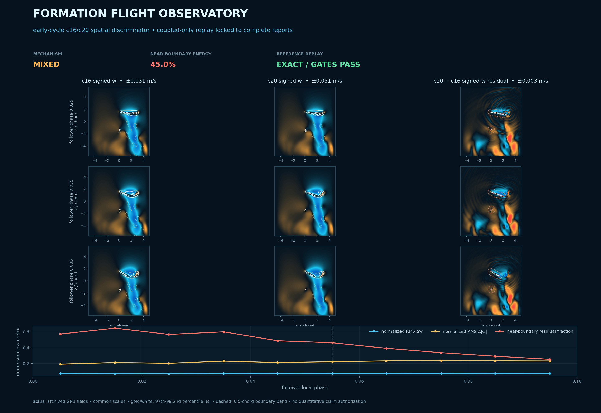

Across follower phase `0.005...0.095`, signed vertical velocity changes only
`7.26...7.62%` normalized RMS and remains correlated at `r≥0.9972`, while
vorticity changes `19.15...23.64%`. The normalized residual evolves from
near-boundary dominated early in the window to wake dominated late; its
aggregate near-boundary fraction is `45.04%`, inside the preregistered mixed
band. The strongest absolute near-boundary probe is phase `0.035` around
`(x/c,z/c)=(1.82,1.02)`; the strongest wake probe is phase `0.095` around
`(2.32,-1.13)`. An independent implementation passes `99/99` checks. This
localizes the next instrumentation but does not authorize a quantitative
formation-benefit claim.

That instrumentation is now complete. A read-only Metal diagnostic decomposes
the exact production owner load at the two selected phases into
reflected-population, interpolation-auxiliary, moving-wall, cover, and uncover
work. The c8 smoke and promoted c16/c20 replays reproduce their locked coupled
histories exactly; maximum component closure remains below `2.32e-7` force,
`1.34e-7` torque, and `8.16e-8` actuator power.

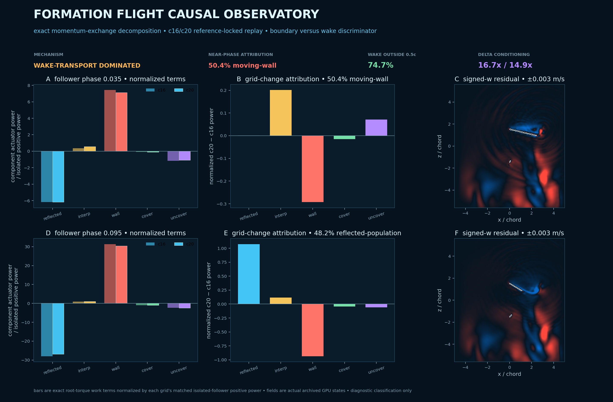

At follower phase `0.035`, moving-wall work accounts for `50.43%` of the
normalized c20-minus-c16 component change and interpolation for an opposing
`34.69%`; neither reaches the preregistered `60%` dominance threshold. At
phase `0.095`, `74.72%` of residual energy is outside the half-chord boundary
band. The frozen result is therefore wake-transport dominated, with an
independent `106/106` audit. Strong cancellation is explicit: the two
grid-difference condition numbers are `16.67` and `14.93`, so this localizes
the mechanism without declaring an individual large work term defective.

The follow-up asks whether that wake difference is merely displaced. It
requires no new CFD: `441` bounded shifts at each of five locked phases compare
mapped c16 signed vertical velocity and vorticity against c20 in the selected
wake region.

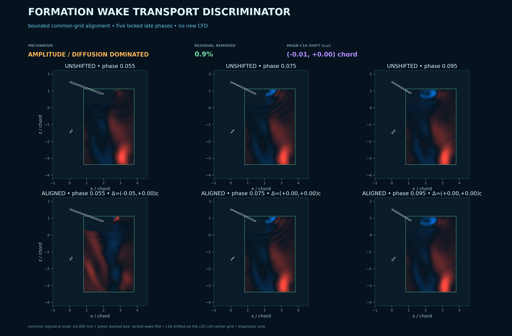

Across all `2,205` alignments, registration removes only `0.852%` of residual
energy. Four phases choose zero displacement; the fifth chooses `-0.05` chord
in `x`, giving a mean `(-0.01,0.00)`-chord shift. The independently reproduced
`41/41` result is **amplitude/diffusion dominated**, not a wake-position or
phase-lag error.

The preregistered one-variable collision discriminator is now complete. A new
diagnostic-only CLI path keeps geometry, kinematics, interpolated boundary,
load estimator, grid, sponge, and gates fixed while replacing production TRT
with the previously qualified positivity-preserving RR3 operator. Population
minimum and limiter activations are fused into the existing load reduction, so
every D3Q19 population is observed on every step without a second population
memory pass. Production remains TRT.

```bash
./Scripts/run-formation-collision-dissipation.sh
```

The c8 smoke completes in `22.23 s`, stays positive at `0.01508`, and needs no
positivity correction. The five-cycle c16 RR3 run completes in `1075.62 s`,
also with zero correction activations, minimum population `0.01560`, force
closure `1.10e-6`, and torque closure `3.70e-6`. It is numerically clean—but
it moves the wrong way: relative to the locked c20 TRT discriminator, RR3
increases aggregate wake residual energy by `28.98%` and dimensionless
force-history residual energy by `84.82%`. The `51/51` independent audit
therefore stops c20 RR3 exactly as preregistered. This rules out positivity
repair as the missing formation-convergence mechanism; it does not treat c20
TRT as truth or promote either operator. A fresh production-TRT c8 replay also
reproduces its pre-instrumentation 100-bin history exactly (`0.0` relative
difference), proving the fused diagnostic is dormant when not requested.

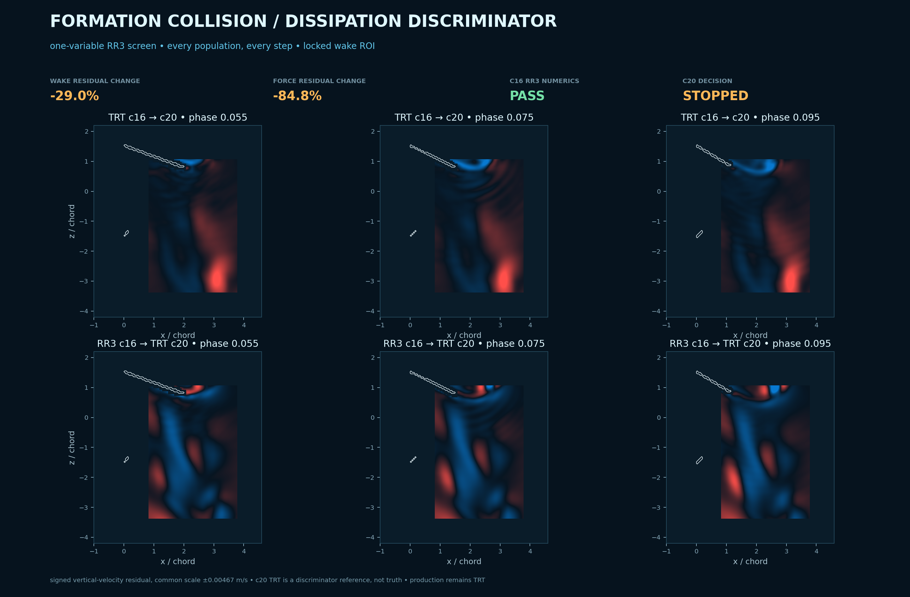

A second preregistered analysis uses no new CFD and divides the locked wake ROI
into three one-chord streamwise bands. The c16-to-c20 TRT residual is already
largest in the upstream band and decreases downstream: downstream/upstream
normalized residual density is `0.818`, below the frozen `1.15`
source-dominated boundary. The result is **source-amplitude dominated**, with
`94/94` independent checks—not accumulating downstream numerical attenuation.

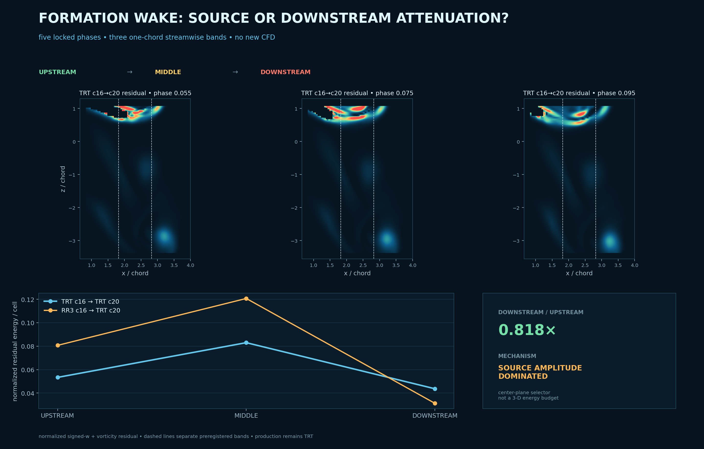

The phase-resolved boundary-population source census is now complete. It uses
the exact production pre-step populations and solid mask, resolves both owners
and all D3Q19 directions at the locked follower phases `0.035` and `0.095`,
and records raw reflection, reconstructed incoming population, interpolation,
moving-wall, link-fraction, wall-kinematic, and branch totals. The diagnostic
is read-only and excludes the automatic phase-zero field capture.

```bash
./Scripts/run-formation-boundary-source-census.sh
```

The first c8 qualification deliberately failed because the host report copied
the intentionally uncaptured phase-zero slot as two zero-support samples. That
negative control is preserved and SHA-locked. The amendment changed only the
report filter, before either discriminating grid ran. The corrected c8 gate
passes with exact history replay and `1.24e-7` reconstruction residual. c16 and
c20 complete in `890.86 s` and `2293.58 s`; both reproduce their locked
histories exactly. Their maximum source-reconstruction residuals are
`9.28e-8`/`9.09e-8`, with force closure `1.14e-6`/`7.17e-7` and torque closure
`4.23e-6`/`4.42e-6`.

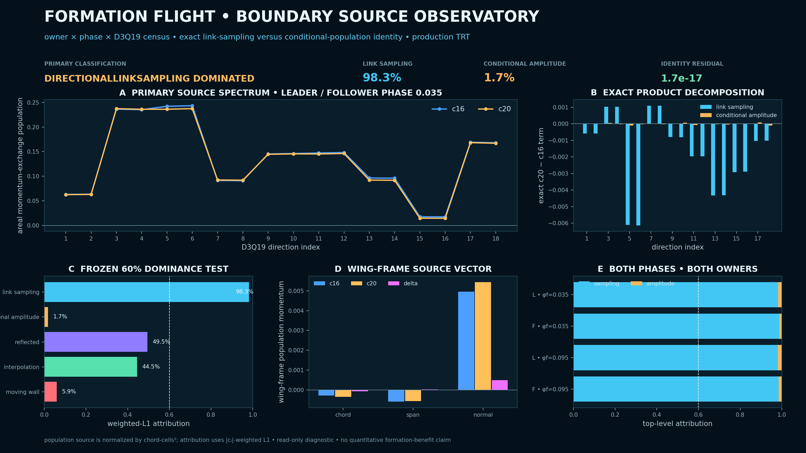

The preregistered primary leader sample at follower phase `0.035` attributes
`98.25%` of the c16-to-c20 source change to the areal directional link measure
and only `1.75%` to conditional per-link population amplitude. Every secondary
owner/phase sample agrees: link-sampling attribution spans
`98.08%...98.85%`. The directionwise symmetric identity closes to
`1.68e-17`; the independent raw-artifact audit passes `319/319`. This rules
out another broad collision or force-law change as the next allocation. It
does not imply a large geometric error: direction-distribution TV is only
`0.55%...0.99%`, while grid-normalized link density falls
`1.37%...2.35%`; those small changes dominate because conditional population
change is smaller still.

An immediate archive-only second identity factors the dominant link measure as
total areal link density times D3Q19 direction probability. It executes with no
new fluid solve:

```bash
./Scripts/run-formation-link-sampling-subdecomposition.sh
```

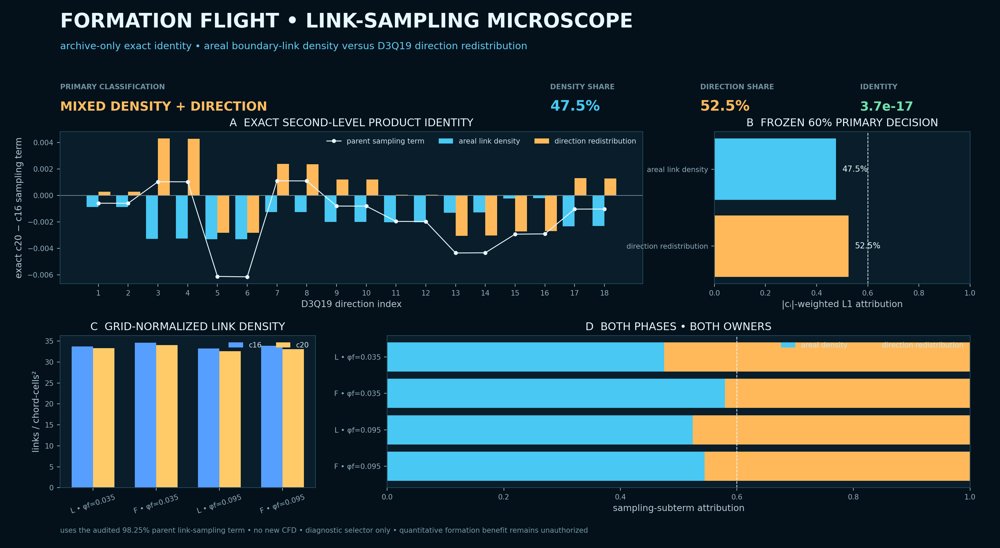

At the frozen primary sample, areal link density supplies `47.55%` and
direction redistribution `52.45%` of the parent sampling term. Neither reaches
the frozen `60%` threshold; all four samples remain mixed. The exact identity
closes below `3.78e-17`, and an independent reconstruction passes `521/521`
checks. The next justified allocation is therefore one **geometry-only c18
bridge at the primary phase retaining both pathways**, not a bulk operator,
stopped c20 minimum, blind global c24 ladder, or production edit. Quantitative
formation benefit remains unauthorized.

That bridge is now complete under a frozen before-execution contract. It uses
the production Metal pose preparation and two-wing voxelizer, but executes
**zero fluid timesteps**:

```bash
./Scripts/run-formation-geometry-c18-bridge.sh
```

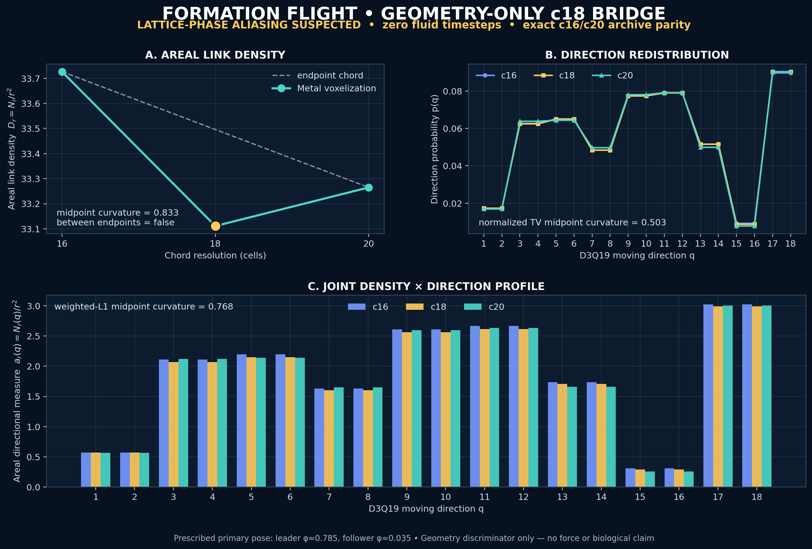

The cheap harness exactly reproduces every archived c16/c20 direction count
for both owners (`76/76` D3Q19 records, including the four zero rest-direction
records) before interpreting c18.
The three prescribed poses take `0.072/0.090/0.118 s` on Apple M4. At the
primary leader pose, areal link density is `33.7266`, `33.1111`, and `33.2650`
for c16/c18/c20: c18 falls below both endpoints. The frozen classifier is
therefore `latticePhaseAliasingSuspected`; normalized density, direction-TV,
and joint-profile midpoint curvatures are `0.833`, `0.503`, and `0.768`.
Independent reconstruction passes `105/105` checks. This result prevents an
expensive c18 fluid run from being misrepresented as smooth refinement. It
selected a geometry-only subcell-offset ensemble at c16/c18/c20 next.

That ensemble is now complete: a full `4 × 4 × 4` tensor of global subcell
translations at each resolution, or **192 Metal poses**, ran with zero fluid
timesteps in `3.71 s` of recorded pose/count work:

```bash
./Scripts/run-formation-geometry-subcell-ensemble.sh
```

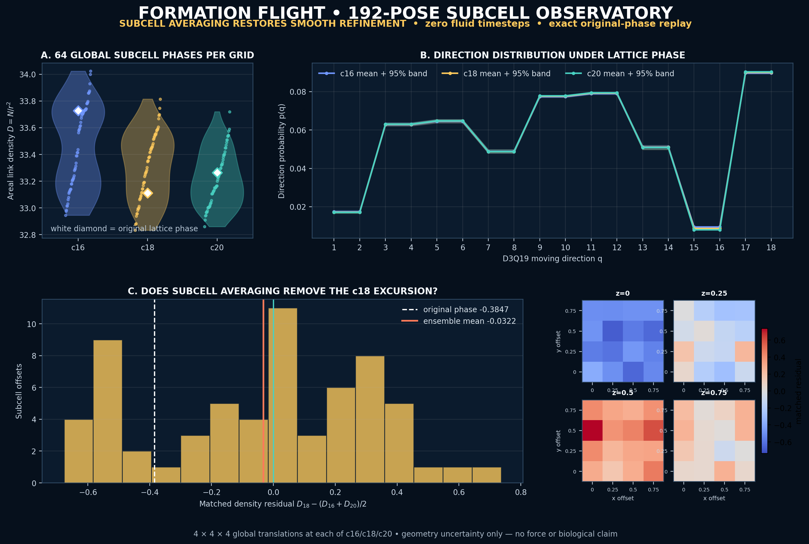

The zero-offset cases reproduce all c16/c18/c20 bridge counts exactly. After
averaging lattice phase, c18 mean density lies between c16 and c20, while the
normalized density, direction, and joint-profile curvatures collapse to
`0.132`, `0.093`, and `0.131`, all below the frozen `0.5` boundary. The locked
classification is `aliasingAveragedOut`; independent reconstruction passes
`334/334` checks. This quantifies geometry uncertainty and clears smooth
**ensemble-mean geometry** refinement only. It does not authorize a force
correction, production edit, quantitative formation benefit, force
convergence, or biological claim.

The selected population-weighted follow-up is also complete. One deterministic
common offset, `[0.25, 0.25, 0.75]` cells, minimizes the summed
sample-SD-normalized distance from the three resolution medians (`0.826`,
versus `1.641` for the legacy zero offset). A new coupled-only diagnostic then
advances the unchanged production TRT solver for five cycles and records one
leader/follower D3Q19 boundary-source census per grid:

```bash
./Scripts/run-formation-subcell-source-census.sh
```

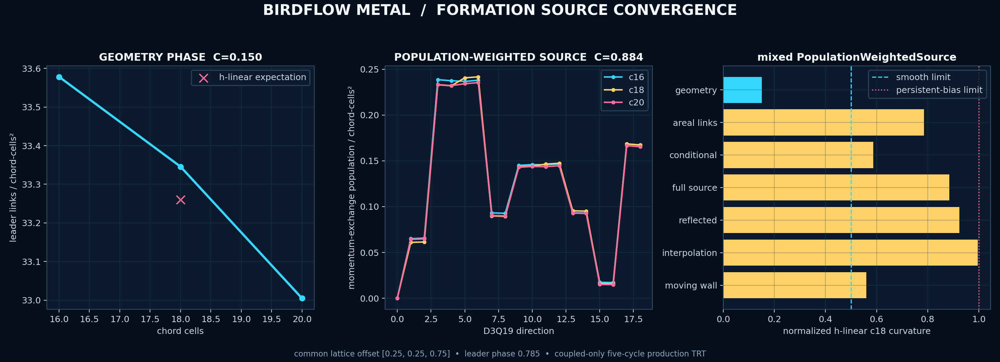

c16/c18/c20 complete in `1016.72/1367.68/2544.79 s` locally on Apple M4.
Every case is finite and overlap-free; worst source reconstruction, force
closure, torque closure, and final-cycle periodic difference are
`8.06e-8`, `7.47e-7`, `3.19e-6`, and `2.395%`. The selected scalar geometry
curvature is smooth at `0.150`, but the direction-resolved areal-link,
conditional-population, and full population-weighted-source curvatures are
`0.785`, `0.587`, and `0.884`. The preregistered classification is therefore
`mixedPopulationWeightedSource`, not convergence. Reflected, interpolation,
and moving-wall component curvatures are `0.924`, `0.997`, and `0.560`, so no
single component yet owns the residual.

The first analysis pass used the decomposed incoming sum instead of the exact
preregistered production incoming value. The independent audit rejected it
`62/64`; that failed audit is preserved byte-for-byte. A documented narrow
post-run correction changed the headline curvature by only `1.2e-7`, did not
change thresholds or classification, and passes the corrected independent
audit `66/66`. This result originally authorized only the two next-best
deterministic offsets (`[0.5,0.75,0.5]` and `[0.25,0,0.5]`) to test phase
robustness before any quantitative formation-power ladder.

The first authorized alternate phase is now complete under a separate pre-CFD
contract:

```bash
PATH=".build/formation-analysis-venv/bin:$PATH" \
  ./Scripts/run-formation-subcell-source-offset2.sh
```

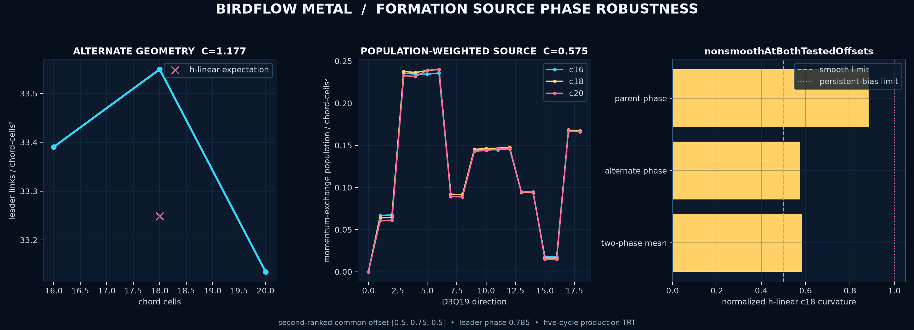

The deterministic second-ranked offset `[0.5,0.75,0.5]` scores `0.843757`,
only `2.18%` above the selected representative score. The unchanged
production-TRT c16/c18/c20 runs complete in `397.70/772.67/1114.85 s`
(`2285.22 s` total). Every case is finite and overlap-free; worst source
reconstruction, force closure, torque closure, and final-cycle periodic
difference are `8.32e-8`, `6.25e-7`, `2.38e-6`, and `2.293%`.

The alternate direction-resolved areal-link, conditional-population, and exact
population-weighted-source curvatures are `0.617`, `0.602`, and `0.575`.
Reflected, interpolation, and moving-wall components are `0.546`, `0.606`, and
`1.055`. The source improves substantially from `0.884` but remains above the
frozen `0.5` smooth boundary; the two-offset mean is `0.584`. The locked result
therefore remains `mixedPopulationWeightedSource`, with independent
reconstruction passing `109/109` checks. Scalar geometry curvature at this
phase is `1.177`, so the result is correctly reported as nonsmooth at both
tested offsets—not misattributed to the population operator alone. Only the
final authorized offset `[0.25,0,0.5]` may complete the minimal robustness set;
formation-power convergence and benefit remain unclaimed.

That final robustness decision is now complete:

```bash
BIRDFLOW_ANALYSIS_PYTHON="$PWD/.build/formation-analysis-venv/bin/python" \
  ./Scripts/run-formation-subcell-source-offset3.sh
```

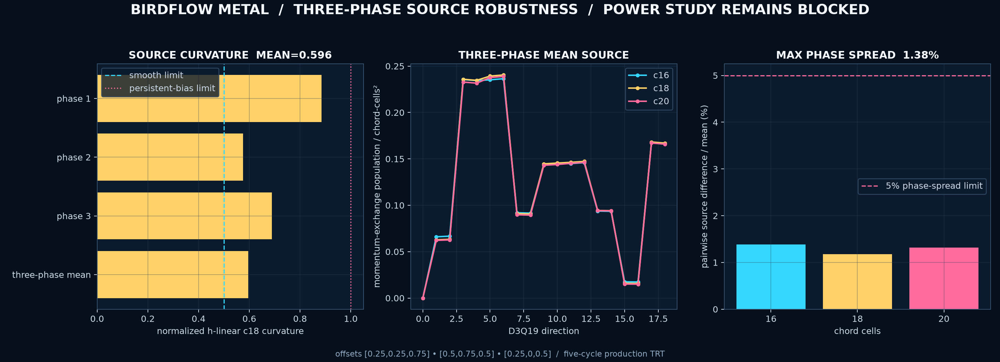

The final offset `[0.25,0,0.5]` completes in `497.74/891.05/1630.52 s` at
c16/c18/c20. Every new case passes unchanged finiteness, overlap, owner,
periodicity, branch, sample-completeness, and reconstruction gates. Across all
three deterministic phases, individual source curvatures are
`0.884/0.575/0.689`; the direction-resolved three-phase mean areal-link,
conditional-population, and exact-source curvatures are
`0.581/0.564/0.596`.

Maximum pairwise exact-source phase spread is only `1.384%`, comfortably below
the frozen `5%` uncertainty gate, but mean source curvature remains above the
unchanged `0.5` smooth boundary. The preregistered quantitative power gate
therefore fails as `mixedPopulationWeightedSourceMean`. Mean reflected,
interpolation, and moving-wall curvatures are `0.621/0.677/0.861`; no single
term owns the residual. The independent raw-artifact audit passes `190/190`.
The wider formation-power map remains blocked; the next admissible allocation
is an archive-only c18 direction/component residual-covariance selector before
one focused phase trace.

That zero-CFD selector is complete under a locked pre-analysis contract:

```bash
BIRDFLOW_ANALYSIS_PYTHON="$PWD/.build/formation-analysis-venv/bin/python" \
  ./Scripts/run-formation-source-residual-covariance.sh
```

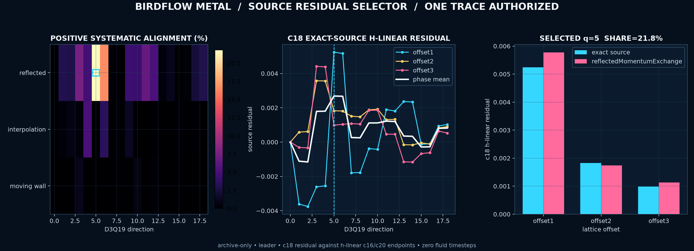

The exact c18 residual against h-linear c16/c20 endpoints is concentrated in
the leader's reflected momentum-exchange term at D3Q19 `q=5`, direction
`[0,0,+1]`. It owns `21.788%` of the positive systematic-alignment ledger
against a frozen `10%` requirement and agrees in all `3/3` lattice offsets.
The opposite reflected direction `q=6` contributes another `16.520%`, exposing
a vertical reflected-population pair rather than a diffuse all-stencil error.
The deterministic strongest trace anchor is `[0.25,0.25,0.75]`; residual
component closure is `1.37e-8`. The independent audit passes `57/57`, and the
selector executes zero fluid timesteps. Exactly one c18 final-cycle temporal
trace is now authorized for leader reflected momentum exchange, `q=5`, at that
offset. It is diagnostic only and does not reopen the power map.

That single preregistered trace is now complete:

```bash
BIRDFLOW_ANALYSIS_PYTHON="$PWD/.build/formation-analysis-venv/bin/python" \
  ./Scripts/run-formation-focused-source-trace.sh
```

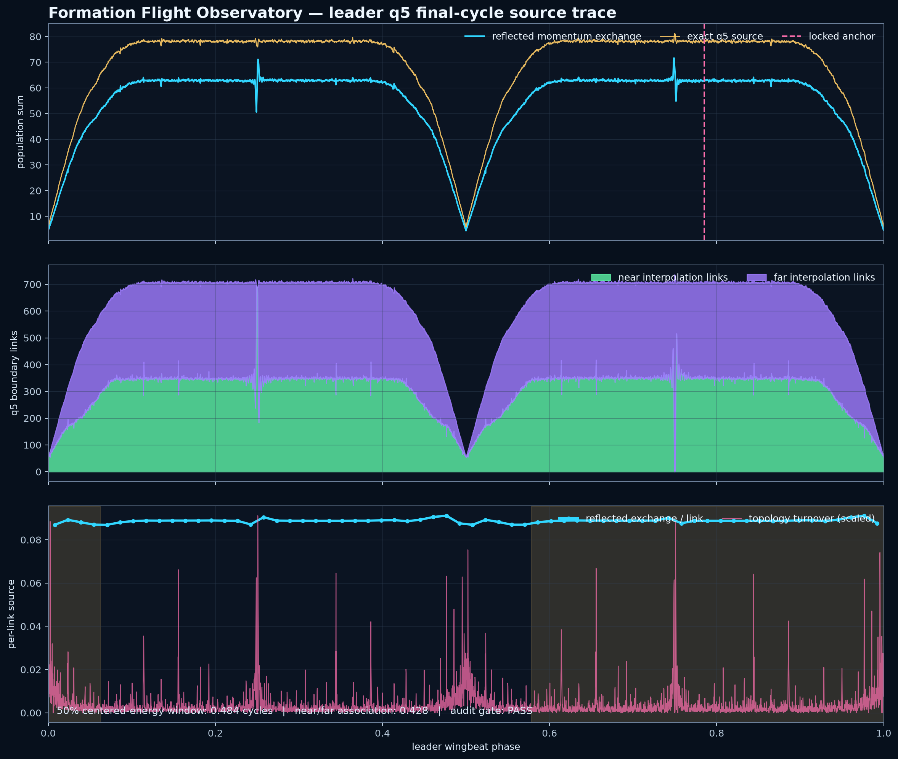

The read-only diagnostic records all `4,820` steps of the final c18 cycle and
reproduces both locked coupled-load summaries and the locked phase-`0.785062`
q5 census exactly: both relative differences are zero. Reconstruction closes
to `2.71e-7`, force/torque closure remains `6.83e-7/3.19e-6`, periodic power
difference remains `2.213%`, and the independent audit passes `59/59` checks.
The production Metal kernel and GPU data layout remain byte-identical to the
baseline.

The preregistered result is `cycleDistributedBranchAssociated`: the shortest
circular window containing half of the phase-binned centered q5 reflected
energy spans `0.4844` cycles, wider than the `0.35` localization limit, while
per-link reflected exchange has `|r|=0.4284` association with near/far branch
occupancy. Total reflected exchange is almost entirely controlled by q5 link
support (`r=0.9988` with link count), and no halfway-fallback link appears.
Therefore a narrow phase-window ladder is rejected. The next justified test is
sparse matched-phase c16/c20 sampling stratified by near/far occupancy—not a
second c18 trace, a broad power map, or a production force change.

See the [scientific contract and scouting matrix](Docs/FORMATION_FLIGHT_OBSERVATORY.md).

The next experimental validation source is now qualified without weakening the
measured-data contract. Deetjen et al.'s Ringneck-dove deposit provides
synchronized processed 3D surfaces, kinematics, and measured horizontal and
vertical aerodynamic-force histories. The selected `OB` flight can be acquired
as a CRC-locked 15 MB engineering subset or a 671 MB subset including its full
surface instead of downloading the 19.3 GB archive. See
[`Docs/DEETJEN_DOVE_BENCHMARK.md`](Docs/DEETJEN_DOVE_BENCHMARK.md). Its inertia
remains modeled, so it advances prescribed-force validation—not measured
schema-2 free flight.

The decoded surface is now a committed 3.73 MB float32 sequence with one fixed
topology for the body, measured left wing, explicitly mirrored right wing, and
tail. It uses the deposited laboratory motion without an artificial periodic
wrap. The compact mesh stays 128 triangles below the current Metal identifier
limit. Independent CPU reconstruction passes every binary, topology, area,
coordinate-bound, and adjacent-frame wall-speed check; the exact artifacts are
[`manifest.json`](ValidationInputs/deetjen-ob-f03-surface-v1/manifest.json) and
[`deetjen-dove-surface-cpu-parity.json`](ValidationArtifacts/deetjen-dove-surface-cpu-parity.json).
The geometry-only Apple M4 replay then dispatches the generic indexed Metal
prepare/raster/resolve path for all 144 frames on a `59 x 53 x 50` grid. It
preserves all four components every frame, matches CPU occupancy exactly at five
milestones, and bounds wall-velocity and signed-distance differences by
`2.182e-5` lattice and `1.574e-5` cells. Five additional fractional-time probes
exercise interpolation between stored frames. The archived 7.02-second result is
[`deetjen-dove-indexed-metal-geometry.json`](ValidationArtifacts/deetjen-dove-indexed-metal-geometry.json).
It deliberately executes no collision or force kernel, so aerodynamic agreement
remains open.

The following production integration gate is deliberately short and isolated:
periodic boundaries and zero sponge leave the moving surface as the only fluid-
momentum source. In `0.24 s`, eight steps exercise 39 newly covered cells, 53
newly uncovered cells, and 101,262 persistent boundary links through the
production interpolated-link, conservative moving-domain force, and TRT fluid
kernels. Direct before/after fluid momentum closes against the recorded load at
`1.789e-5` relative RMS, with `3.8846e-8 kg m/s` maximum absolute residual.
Evidence is
[`deetjen-dove-indexed-production-coupling.json`](ValidationArtifacts/deetjen-dove-indexed-production-coupling.json).
This accepts coupling and impulse accounting, not developed flow or agreement
with the measured force platform.

The deposited force-processing and muscle-model scripts now close the last
input-side ambiguity independently. They establish that platform `FxWings`
maps to source world-forward `y`, both stored platform channels must be negated
to obtain force on the bird, and source world `[y,z]` maps to BirdFlow `[x,z]`.
The resulting measured target is therefore
`[-FxWings, unavailable, -FzWings]`; lateral force is deliberately absent, not
zero-filled. Nearest-sample registration and integer camera arithmetic agree
at all 144 surface frames, with 143 explicit half-frame interpolation samples
between them. The 287-sample target, source-code registration, and independent
committed-input audit are
[`deetjen-ob-f03-force-v1.json`](ValidationInputs/deetjen-ob-f03-force-v1.json),
[`deetjen-dove-force-registration.json`](ValidationArtifacts/deetjen-dove-force-registration.json),
and
[`deetjen-dove-force-target-cpu-parity.json`](ValidationArtifacts/deetjen-dove-force-target-cpu-parity.json).
This clears a coarse prescribed-motion pilot, not experimental agreement or
the refinement ladder.

That pilot is now executed and archived rather than silently tuned. It advances
the measured motion through nonperiodic far-field TRT at 16 fluid steps per
2 kHz force sample. The authors' analysis window is scored only from `0.025` to
`0.118 s` (187 samples), after a locked 800-step pre-roll. At the deliberately
coarse `0.01 m` grid, the source viscosity would require `tau+=0.50001469`,
below the single-precision guard, so the run uses a declared `tau+=0.501`
viscosity floor—`68.07x` the source viscosity—and applies no experimental-
agreement gate.

The Apple M4 pilot stops before comparison: the first sampled negative D3Q19
population occurs at step 176 (`5.5 ms`), direction 7, fluid cell
`[31,35,29]`, only `0.0764` cells from the surface; the load becomes nonfinite
at step 331. The independent artifact audit passes while the integration gate
fails. This is a useful negative result: force normalization, target sign, and
the scored window are not the immediate blocker. Evidence is
[`deetjen-dove-coarse-force-pilot.json`](ValidationArtifacts/deetjen-dove-coarse-force-pilot.json)
and
[`deetjen-dove-coarse-force-pilot-audit.json`](ValidationArtifacts/deetjen-dove-coarse-force-pilot-audit.json).
The fixed-input collision screen is now complete with population diagnostics at
every step. Production TRT first becomes negative at step 150 (`4.6875 ms`) in
the same direction-7 cell. Positivity-preserving regularized BGK and RR3 both
finish all 800 pre-roll steps with finite loads and positive populations.
Regularized BGK activates its convex correction in 55 cell-steps
(`2.013e-7` of all cell-steps); RR3 activates in 28 (`1.025e-7`). The archive
and independent audit are
[`deetjen-dove-collision-pre-roll-ab.json`](ValidationArtifacts/deetjen-dove-collision-pre-roll-ab.json)
and
[`deetjen-dove-collision-pre-roll-ab-audit.json`](ValidationArtifacts/deetjen-dove-collision-pre-roll-ab-audit.json).
Both candidates then replayed the same 800 steps with a fixed control surface
five cells outside the swept bird and outside the six-cell sponge. The
conservative load closed against independent momentum storage plus surface flux
at `0.07944%` relative RMS for regularized BGK and `0.07987%` for RR3. A second
whole-domain before/after fluid ledger, corrected only for measured far-field
and sponge impulse, closed at `0.11459%` and `0.11453%`. No solid crossed the
control surface. The complete histories and independently reconstructed
arithmetic are
[`deetjen-dove-collision-momentum-closure.json`](ValidationArtifacts/deetjen-dove-collision-momentum-closure.json)
and
[`deetjen-dove-collision-momentum-closure-audit.json`](ValidationArtifacts/deetjen-dove-collision-momentum-closure-audit.json).
Both candidates then completed the fixed 3,776-step extended pilot through all
187 registered comparison samples. Every-step diagnostics remained finite and
positive. Regularized BGK retained only 55 corrected cell-steps
(`4.265e-8` of all cell-steps), while RR3 retained 28 (`2.171e-8`). Their
phase histories are close: endpoint and interval-mean pairwise normalized RMS
differences are `0.656%` and `0.882%`. The archive and independent
reconstruction are
[`deetjen-dove-collision-extended-pilot.json`](ValidationArtifacts/deetjen-dove-collision-extended-pilot.json)
and
[`deetjen-dove-collision-extended-pilot-audit.json`](ValidationArtifacts/deetjen-dove-collision-extended-pilot-audit.json).
The endpoint measured-force errors (`5.665`/`5.676`) and interval errors
(`2.274`/`2.264`) are recorded but not acceptance gates because this grid uses
`68.07x` source viscosity. The subsequent fixed-physics D=8/D=12 discriminator
held physical domain, thickness, viscosity, Mach, geometry, timing, and gates
constant. Both operators cleared both grids; their trend scores were nearly
tied (`0.12545`/`0.12508`) and disagreement decreased from `0.882%` to
`0.816%`. The preregistered cross-canonical rule therefore selected RR3 and
authorized only its D=16 run. That completion stopped at step `751/7,552` on a
negative direction-0 population `0.215` cells from the surface while loads
remained finite. The negative result is independently audited; no second D=16
operator or unavailable force-convergence value was substituted.

The follow-up sparse provenance replay captures steps `747...751` at that cell
without modifying production state. Its duplicate stage algebra predicts every
actual RR3 direction-0 write bit-for-bit. At step 751, direction 0 is still
positive after reconstruction (`0.005964`), but moving-boundary reconstruction
has already made directions `2, 8, 12, 13, 16` negative. The resulting local
speed is `1.00746` lattice units (Mach `1.74497`), beyond the direction-0
equilibrium positivity limit `0.816497`. RR3's positivity scale collapses to
zero and collision writes the negative equilibrium `-0.00342597`; topology
refill, far field, and sponge are excluded. The archived capture and independent
RR3 reconstruction are
[`deetjen-dove-d16-population-stage-provenance.json`](ValidationArtifacts/deetjen-dove-d16-population-stage-provenance.json)
and
[`deetjen-dove-d16-population-stage-provenance-audit.json`](ValidationArtifacts/deetjen-dove-d16-population-stage-provenance-audit.json).

The next sparse replay decomposes all 17 moving-boundary directions at steps
750 and 751. It matches the stage archive within `1.892e-10` and closes every
reflected + auxiliary + wall sum within `1.747e-10`. The negative direction set
changes from `2, 3, 10` to `2, 8, 12, 13, 16`; at failure, all reflected
populations and auxiliary contributions are nonnegative, while the wall
correction is negative in all five. Four links are already halfway fallbacks,
and moving-wall halfway fixes none; removing the wall term makes all five
positive. This clears interpolation and inherited reflection as the primary
repair surface and isolates moving-wall correction admissibility. Evidence is
[`deetjen-dove-d16-boundary-term-decomposition.json`](ValidationArtifacts/deetjen-dove-d16-boundary-term-decomposition.json)
with its
[`independent audit`](ValidationArtifacts/deetjen-dove-d16-boundary-term-decomposition-audit.json).

The locked one-cell moving-wall discriminator then reuses those archives
without rerunning the fluid simulation. Scaling the wall correction by the
pre-step local density (`0.030193`, candidate A) removes all five negative
populations, leaves a `5.580e-5` minimum, and restores equilibrium
admissibility at lattice Mach `0.5482` without a positivity limiter. A
reference-density correction with a worst-link positivity scale (candidate B)
also survives, but requires an active global scale of `0.11505`. Candidate A
therefore advances only to a controlled force/momentum-ledger experiment; it
is not enabled in production. Evidence is
[`deetjen-dove-d16-moving-wall-admissibility-ab.json`](ValidationArtifacts/deetjen-dove-d16-moving-wall-admissibility-ab.json)
with its
[`independent audit`](ValidationArtifacts/deetjen-dove-d16-moving-wall-admissibility-ab-audit.json).

Candidate A has now passed its controlled D=16 production-ledger experiment.
On Apple M4 it completed the retained `751`-step failure horizon in `22.81 s`
on the unchanged `149 x 136 x 131` grid. The minimum population remained
positive at `1.634e-8`; the near-wing and global relative RMS force/momentum
residuals were `4.719e-4` and `5.306e-4`, respectively, against the locked
`0.005` limit. The control surface remained roughly 11 cells outside the swept
bird, no solid link crossed it, and the opt-in wall candidate used no wall
positivity limiter. Only two recursive-collision corrections occurred
(`1.003e-9` of cell-steps). Production still uses the reference-density wall
law: this result authorizes only a full registered-window D=16 candidate-A
run. Evidence is
[`deetjen-dove-d16-moving-wall-ledger.json`](ValidationArtifacts/deetjen-dove-d16-moving-wall-ledger.json)
with its independently reconstructed
[`nine-check audit`](ValidationArtifacts/deetjen-dove-d16-moving-wall-ledger-audit.json).

The source-locked full-window promotion also passes. Candidate A completes all
`7,552` D=16 steps in `293.34 s`, retains a positive `1.025e-8` minimum
population, and captures all 187 registered force samples. Near-wing and
global relative RMS residuals are `6.247e-4` and `8.312e-4`, still well below
`0.005`; only 34 RR3 corrections occur (`1.696e-9` of cell-steps), with no
wall limiter or production-default change. The descriptive two-component
force error is `2.1731` normalized RMS: stability and accounting are cleared,
but the fixed `68.07x` viscosity floor and absent candidate-specific spatial
refinement prohibit experimental agreement. Evidence is
[`deetjen-dove-d16-moving-wall-full-window.json`](ValidationArtifacts/deetjen-dove-d16-moving-wall-full-window.json)
and its independent
[`11-check audit`](ValidationArtifacts/deetjen-dove-d16-moving-wall-full-window-audit.json).

The preregistered candidate-A spatial discriminator is now complete—and it
honestly rejects clearance. Full-window D=8 and D=12 runs both pass positivity,
all 187 registered bins, and the independent near-wing/global ledgers; the
existing D=16 archive is reused byte-for-byte. Force-history change decreases
monotonically from `12.705%` (D8→D12) to `6.268%` (D12→D16), while fine-pair
mean and impulse differences are only `1.058%`. However, `6.268%` exceeds the
preregistered `5%` force-history limit, so spatial refinement and production
promotion remain blocked. The green independent audit authenticates this
locked rejection. Evidence is the
[`preregistration`](ValidationArtifacts/deetjen-dove-moving-wall-spatial-preregistration.json),
[`D8 case`](ValidationArtifacts/deetjen-dove-d8-moving-wall-full-window.json),
[`D12 case`](ValidationArtifacts/deetjen-dove-d12-moving-wall-full-window.json),
[`discriminator`](ValidationArtifacts/deetjen-dove-moving-wall-spatial-discriminator.json),
and [`independent audit`](ValidationArtifacts/deetjen-dove-moving-wall-spatial-discriminator-audit.json).

The zero-simulation phase localization rejects an immediate D=20 allocation.
The D12-to-D16 difference is mixed rather than a single event or smooth
distributed truncation: 27 of 187 bins carry half its squared difference,
the strongest 5 ms window carries only `16.81%`, yet normalized adjacent-bin
roughness is `1.351` and `50.27%` of non-DC spectral energy is high-frequency.
Topology correction explains only `12.62%`; near-wing/global ledger-residual
differences are only `0.375%/0.749%` of the force difference. Thus neither a
topology spike nor closure-accounting error explains the miss, but its rough
inter-grid structure is not evidence for smooth asymptotic convergence. See
the [`phase-localization artifact`](ValidationArtifacts/deetjen-dove-moving-wall-spatial-localization.json)
and [`independent audit`](ValidationArtifacts/deetjen-dove-moving-wall-spatial-localization-audit.json).

The source-locked lag/band discriminator then eliminates sub-bin force
registration as the dominant mechanism. The best global shift is only
`-0.02` force bins (`-10 us`), and five-fold held-out validation improves the
D12-to-D16 comparison by just `1.506%`. A nonperiodic 200 Hz low-pass reduces
the normalized difference from `6.268%` to `4.253%`, but retains only `74.27%`
of combined force energy against the frozen `99%` requirement. Filtering away
one quarter of the physical signal cannot be relabeled as convergence.
Neither broadband estimator noise nor coherent low-band grid bias is therefore
established; the result remains `mixed-unresolved`, the original `5%` raw gate
is unchanged, and D=20 remains blocked. The
[`lag/band artifact`](ValidationArtifacts/deetjen-dove-moving-wall-spatial-lag-band.json)
and [`11-check independent audit`](ValidationArtifacts/deetjen-dove-moving-wall-spatial-lag-band-audit.json)
make that negative result reproducible without another fluid simulation.

The follow-up fixed-geometry temporal canonical runs in `10.82 s` and removes
topology and evolving kinematics entirely. At the most discrepant archived
phase (`26.5 ms`), both D12 and D16 hold the same measured geometry and wall
velocity for eight 0.5 ms bins while recording every conservative-force
substep. Endpoint sampling differs by `19.587%`; sample-centered trapezoidal
and direct impulse-preserving aggregation reduce this to `9.760%` and
`9.487%`. Aggregation therefore removes `51.56%` of the endpoint disagreement,
but the authoritative impulse-preserving history still fails 5%. The complete
eight-bin impulses differ by only `0.864%`, both momentum ledgers pass below
`0.036%`, topology correction is exactly zero, and the independent 13-check
audit passes. Classification remains `mixed-unresolved`; the original raw
rejection and D20 block are unchanged. Evidence is the locked
[`preregistration`](ValidationArtifacts/deetjen-dove-moving-wall-temporal-sampling-preregistration.json),
[`Metal result`](ValidationArtifacts/deetjen-dove-moving-wall-temporal-sampling.json),
and [`independent audit`](ValidationArtifacts/deetjen-dove-moving-wall-temporal-sampling-audit.json).

The preregistered 24-bin extension rules out startup relaxation. Its
independent restart reproduces every original eight-bin vector exactly.
Impulse-preserving D12/D16 history differences are `9.487%`, `9.929%`, and
`9.961%` for the 8/16/24-bin prefixes; the three eight-bin blocks are
`9.487%`, `28.208%`, and `12.379%`. The late block is `30.48%` worse than the
first, while the full 24-bin cumulative impulse difference reaches `4.716%`.
Both 576/768-step cases retain positive populations, exact zero topology, and
sub-`0.069%` ledgers. The locked classification is therefore
`persistent-fixed-wall-grid-disagreement`: temporal aggregation matters, but
neither longer duration nor cumulative cancellation clears the force history.
The [`duration preregistration`](ValidationArtifacts/deetjen-dove-moving-wall-temporal-duration-preregistration.json),
[`24-bin Metal result`](ValidationArtifacts/deetjen-dove-moving-wall-temporal-duration.json),
and [`13-check independent audit`](ValidationArtifacts/deetjen-dove-moving-wall-temporal-duration-audit.json)
preserve that negative result. D20 and production promotion remain blocked.

The geometry-only follow-up completes in `4.99 s` on Apple M4 and enumerates
the exact production solid-to-fluid D3Q19 convention at the same `26.5 ms`
phase without allocating populations. Metal and the independent CPU raster
match every occupancy cell and every link count; force-relevant aggregate
parity is within `0.182%`. D12→D16 total link measure changes only `1.362%`,
the worst component changes `2.301%`, the 20-bin interpolation-fraction total
variation is `3.143%`, and the worst grid-to-grid mean wall-velocity change is
only `0.418%` of triangle-quadrature RMS. Area and interpolation therefore
clear. The left-wing deposited mean velocity does not: its independent
thickened-triangle error is `10.742%` at D12 and `10.379%` at D16 against the
frozen `10%` limit. The locked classification is
`wall-velocity-deposition-bias`; D20 remains blocked. The version-2 contract
also records why its pointwise CPU tolerance was corrected to the repository's
pre-existing geometry-parity envelope while adding a stricter `0.5%` complete
link-aggregate gate. Evidence is the
[`preregistration`](ValidationArtifacts/deetjen-dove-moving-wall-link-geometry-preregistration.json),
[`geometry-only result`](ValidationArtifacts/deetjen-dove-moving-wall-link-geometry.json),
and [`13-check independent audit`](ValidationArtifacts/deetjen-dove-moving-wall-link-geometry-audit.json).

The follow-up velocity-sampling A/B advances no fluid and completes in
`21.22 s`. It reproduces the archived production moments exactly, then tests
both endpoint-interpolated velocity and an exact same-component
triangle-barycentric velocity at every reconstructed link intersection.
Neither explains the left-wing miss: the exact candidate changes the worst
mean error from `10.742%` to `10.783%`, while endpoint interpolation worsens
it to `11.430%`. Instead, the link-location check exposes a maximum
offset-surface residual of `0.874` cell against the frozen `0.75`-cell limit
(`0.0696`-cell RMS still passes). The classification is therefore
`signed-distance-intersection-placement-bias`; no velocity repair or
production change is authorized. Evidence is the locked
[`A/B preregistration`](ValidationArtifacts/deetjen-dove-moving-wall-link-velocity-preregistration.json),
[`direction-resolved result`](ValidationArtifacts/deetjen-dove-moving-wall-link-velocity.json),
and [`13-check independent audit`](ValidationArtifacts/deetjen-dove-moving-wall-link-velocity-audit.json).

The preregistered outlier localizer then scans all `25,262` D12 and `45,514`
D16 links in `0.40 s`, again without populations or force evaluation. Only
`8` and `7` links exceed `0.75` cell—`0.0251%` and `0.0122%` of total link
measure. None is on a true mesh boundary; `7/8` and `7/7` lie within `0.25`
cell of another component's physical offset surface. Their dominant D3Q19
directions differ and contain only `25.0%`/`28.6%` of outlier measure, rejecting
a common stencil-direction association. The locked result is
`mesh-edge-or-component-junction-associated`, descriptively narrowed to
component junctions. It authorizes only an exact offset-surface ray-root A/B
on these 15 archived links. Evidence is the
[`localization preregistration`](ValidationArtifacts/deetjen-dove-moving-wall-link-intersection-preregistration.json),
[`per-link archive`](ValidationArtifacts/deetjen-dove-moving-wall-link-intersection.json),
and [`binary-mesh 13-check audit`](ValidationArtifacts/deetjen-dove-moving-wall-link-intersection-audit.json).

The exact ray-root A/B resolves those 15 links in `0.072 s`. Every solid/fluid
endpoint pair selects different nearest components, and every fluid endpoint
selects the previously recorded alternate component. Linear interpolation is
therefore blending two different surface-distance functions. Exact global-
union roots remain far from production: junction RMS shifts are `0.519` cell
on D12 and `0.943` on D16, with a `1.136`-cell maximum against the unchanged
`0.10` RMS/`0.75` maximum limits. D16's exact global roots are all the owner
roots, so its owner-to-union improvement is zero. Numerical roots close below
`7.0e-7` cell and a separate NumPy reconstruction agrees. The locked result is
`junction-global-root-linearization-bias`; no production change or fluid run
is authorized. Evidence is the
[`ray-root preregistration`](ValidationArtifacts/deetjen-dove-moving-wall-link-ray-root-preregistration.json),
[`15-link A/B`](ValidationArtifacts/deetjen-dove-moving-wall-link-ray-root.json),
and [`independent 13-check audit`](ValidationArtifacts/deetjen-dove-moving-wall-link-ray-root-audit.json).

The follow-on coefficient discriminator evaluates the exact production
interpolated-bounce-back algebra on those same 15 links in under `0.04 ms`,
without geometry search or populations. Replacing linear `q` with the exact
global-union `q` changes the `q=0.5` stencil branch on `3/8` D12 links and all
`7/7` D16 links. The measure-weighted coefficient-vector L1 change reaches
`1.723` on D12 and `2.782` on D16, with a `3.189` maximum against frozen
`0.10` RMS and `0.25` maximum limits. The independently reproduced result is
`branch-changing-coefficient-sensitive`. This historically cleared only the
narrow captured-population replay resolved immediately below; by itself it did
not establish a force correction or authorize production or D20. Evidence is the
[`coefficient preregistration`](ValidationArtifacts/deetjen-dove-moving-wall-link-coefficient-preregistration.json),
[`15-link coefficient archive`](ValidationArtifacts/deetjen-dove-moving-wall-link-coefficient.json),
and [`independent 12-check audit`](ValidationArtifacts/deetjen-dove-moving-wall-link-coefficient-audit.json).

The decisive follow-up captures the actual production primitives on all eight
D12 outliers at every one of the `576` fixed-phase steps: `4,608` link-step
records in `10.02 s`. The first diagnostic archive is intentionally retained:
it exposed four production halfway fallbacks and failed source reproduction
because it attempted a near-wall counterfactual where the required farther
fluid node was solid. Contract revision 2 preserves every `10%` local and `1%`
global materiality threshold while applying the same feasibility rule to exact
`q`. Only three links can actually change branches; one exact root must retain
halfway fallback. Production then reconstructs within `3.32e-9`, with zero
source-record mismatches, positive populations, and both momentum ledgers below
`5.94e-4` relative RMS.

The realized exact-`q` effect is small: `1.822%` population RMS, `1.094%`
outlier-force RMS, `0.1085%` of global force RMS, and `0.4428%` of global
impulse. A separate Python implementation rebuilds all populations, forces,
torques, step reductions, impulses, hashes, and the transparent revision with
all 12 checks passing. The locked classification is
`realized-population-insensitive`; it rejects a boundary-law A/B and D16 replay
for these sparse links and leaves production unchanged. Evidence is the
[`fallback-aware preregistration`](ValidationArtifacts/deetjen-dove-moving-wall-link-population-fallback-preregistration.json),
[`4,608-sample Metal archive`](ValidationArtifacts/deetjen-dove-moving-wall-link-population-fallback.json),
and [`independent audit`](ValidationArtifacts/deetjen-dove-moving-wall-link-population-fallback-audit.json).
The distributed follow-up is now complete. A read-only Metal capture decomposes
every production boundary link at every fixed-phase step—`25,262 × 576` links
on D12 and `45,514 × 768` on D16—into base reflection, moving-wall correction,
and interpolation residual. It closes against production force to
`6.31e-6`/`5.01e-6` relative RMS, reproduces the prior 24-bin histories below
`2.63e-5`, preserves positivity and both momentum ledgers, and records zero
metadata or link-classification mismatches.

The result is deliberately not oversold. Base reflection supplies `89.90%` of
the full-window aligned D12/D16 delta, but the eight-bin winners are reflection,
moving wall, and moving wall. No term reaches the frozen `60%` dominance gate
in all three blocks; no component, D3Q19 direction, or `q` bin reaches the
spatial `60%` gate; and `518/1,440` active joint bins are required for `80%` of
absolute aligned contribution. The independently reconstructed classification
is therefore `mixed-term-distributed-grid-bias`. D20 and production changes
remain blocked. Evidence is the
[`distributed-force preregistration`](ValidationArtifacts/deetjen-dove-moving-wall-distributed-force-preregistration.json),
[`D12/D16 Metal archive`](ValidationArtifacts/deetjen-dove-moving-wall-distributed-force.json),
and [`independent 14-check audit`](ValidationArtifacts/deetjen-dove-moving-wall-distributed-force-audit.json).

The preregistered covariance follow-up now closes the cancellation mechanism
without another fluid run. Base reflection plus moving wall is the dominant
pair in all three eight-bin blocks and is always canceling. Its interaction is
`-9.400×` the small residual total-delta energy; the block values are `-3.732×`,
`-32.440×`, and `-163.207×`. The large ratios are expected when two larger
terms nearly cancel. The centered/mean identity shows that `98.324%` of the
pair's absolute decomposition comes from opposing mean offsets, not phase
fluctuations. Energy closure is `1.78e-7` relative and an independent Python
implementation passes all nine checks. The classification is
`robust-canceling-mean-offset-dominated-pair-covariance`. Evidence is the
[`covariance preregistration`](ValidationArtifacts/deetjen-dove-moving-wall-force-covariance-preregistration.json),
[`archive-only report`](ValidationArtifacts/deetjen-dove-moving-wall-force-covariance.json),
and [`independent audit`](ValidationArtifacts/deetjen-dove-moving-wall-force-covariance-audit.json).

The exact paired spatial allocation is also complete. It assigns every within-
and cross-bin interaction symmetrically, closes the global mean interaction to
`1.12e-14` relative, and produces byte-identical reports across independent
processes. No axis clears the frozen `60%` gate: left wing leads components at
`44.39%`, direction 2 leads stencil directions at `10.19%`, and `q` bin 13
leads interpolation fractions at `10.49%`. Reaching `80%` requires `591/1,440`
joint bins, while cancellation-supporting and opposing absolute contributions
split `50.10%`/`49.90%`. The independently reproduced classification is
`distributed-spatial-mean-cancellation`; a targeted primitive capture is
rejected. Evidence is the
[`spatial-interaction preregistration`](ValidationArtifacts/deetjen-dove-moving-wall-spatial-interaction-preregistration.json),
[`exact allocation`](ValidationArtifacts/deetjen-dove-moving-wall-spatial-interaction.json),
and [`independent audit`](ValidationArtifacts/deetjen-dove-moving-wall-spatial-interaction-audit.json).

The source-property/Reynolds audit is now complete without another fluid run.
The deposited `MuscleModel.m` exactly supplies `rho=1.18 kg/m^3` and
`mu=1.849e-5 Pa s`; all D8/D12/D16 lattice reconstructions close the declared
`68.07195x` viscosity floor. These are author-code conventions, not recorded
same-flight atmospheric measurements: the paper reports no ambient temperature,
pressure, humidity, or Reynolds number. Its Table 2 flight speed is
`1.23 +/- 0.13 m/s` across the study.

The solver's source-property Reynolds proxy is `128,813`, based on the converted
maximum surface speed `25.2304 m/s` and engineering length `0.08 m`. The closest
source-data proxy is `102,417`, based on the deposited maximum blade-element
speed `21.3687 m/s` and the selected bird's area/radius mean chord
`0.0751015 m`; the definitions differ by `25.773%`. Thus the viscosity source is
confirmed, but the registered Reynolds number must remain explicitly labeled an
engineering maximum-wall-speed proxy. The unchanged `tau+ >= 0.50005` margin is
first met at D28 under fixed-Courant scaling; D20 cannot meet it. Evidence is the
[`source-scaling preregistration`](ValidationArtifacts/deetjen-dove-source-scaling-preregistration.json),
[`equation-only report`](ValidationArtifacts/deetjen-dove-source-scaling.json),
and [`independent ten-check audit`](ValidationArtifacts/deetjen-dove-source-scaling-audit.json).

That diagnostic and the first margin-compliant grid are now complete. The
preregistered D16 source-viscosity A/B preserved the public `tau+>=0.50005`
guard and used a package-only `0.50002` construction floor. Both regularized
operators completed all 1,600 steps at `tau+=0.50002939`. Their minimum
populations were `9.34e-9` and `1.05e-8`; worst near-wing/global momentum
residuals were `0.0686%` and `0.0658%`; correction activated in only 46 and 7
of `4.247 billion` cell-steps. The independent implementation passes all 15
checks. Evidence is the
[`D16 preregistration`](ValidationArtifacts/deetjen-dove-source-viscosity-d16-preregistration.json),
[`two-operator report`](ValidationArtifacts/deetjen-dove-source-viscosity-d16-ab.json),
and [`independent audit`](ValidationArtifacts/deetjen-dove-source-viscosity-d16-audit.json).

The deterministic evidence rule selected RR3 for D28. The locked
`259 x 238 x 229` case contains `14,116,018` cells, uses a conservative
`3.61 GB` working-set estimate, and clears the normal production constructor at
`tau+=0.50005144`. Its 2,800-step pre-roll passed first. The full-window
preregistration was then frozen before output was observed, with RR3, 13,216
steps, 56 steps per comparison bin, 187 bins, `0.5%` momentum-ledger limits,
and a `5%` correction-intrusion limit unchanged.

On Apple M4, that single D28 allocation completed in `2,706.01 s`. Minimum
population remained positive at `4.84e-9`; near-wing/global momentum residuals
were `0.0824%/0.1507%`; correction activated in `0.00136%` of cell-steps; and
all 187 registered force bins were recorded. The independent audit reconstructs
all 13,216 step-level ledger records and every bin, and all 17 checks pass.
Evidence is the
[`D28 preregistration`](ValidationArtifacts/deetjen-dove-source-viscosity-d28-preregistration.json),
[`production-margin pre-roll`](ValidationArtifacts/deetjen-dove-source-viscosity-d28-pre-roll.json),
[`pre-registered full-window contract`](ValidationArtifacts/deetjen-dove-source-viscosity-d28-full-window-preregistration.json),
[`full-window report`](ValidationArtifacts/deetjen-dove-source-viscosity-d28-full-window.json),
and [`independent full-window audit`](ValidationArtifacts/deetjen-dove-source-viscosity-d28-full-window-audit.json).

The force comparison is deliberately descriptive: joint normalized RMS error
is `2.1357`. Exploratory decomposition finds recognizable vertical-force shape
(`r=0.848`) but a `39.0%` high mean, while horizontal force has weak shape
agreement (`r=0.343`) and a `74.5%` mean deficit. A best vertical correlation
lag of only `2 ms` rules out a simple large phase shift. See the explicitly
post-hoc [`force diagnosis`](ValidationArtifacts/deetjen-dove-source-viscosity-d28-force-diagnosis.json).

The same-physics D32 discriminator is now complete. Its preregistered `296 x
271 x 261` RR3 allocation contains `20,936,376` cells, uses a conservative
`5.36 GB` working-set estimate, and advances source viscosity at
`tau+=0.50005877`. The 3,200-step pre-roll completed in `923.59 s`; its
18-check independent audit authorized only the full window. The separately
preregistered 15,104-step window then completed on Apple M4 in `4,627.86 s`,
recording all 187 force bins. Minimum population remained positive at
`4.69e-9`; near-wing/global relative RMS ledger residuals were
`0.1613%/0.0964%`; correction activated in only `0.00144%` of cell-steps; and
all 17 independent audit checks passed. Evidence is the
[`D32 preregistration`](ValidationArtifacts/deetjen-dove-source-viscosity-d32-preregistration.json),
[`pre-roll`](ValidationArtifacts/deetjen-dove-source-viscosity-d32-pre-roll.json),
[`pre-roll audit`](ValidationArtifacts/deetjen-dove-source-viscosity-d32-audit.json),
[`full-window preregistration`](ValidationArtifacts/deetjen-dove-source-viscosity-d32-full-window-preregistration.json),
[`full-window report`](ValidationArtifacts/deetjen-dove-source-viscosity-d32-full-window.json),
and [`full-window audit`](ValidationArtifacts/deetjen-dove-source-viscosity-d32-full-window-audit.json).

The post-result refinement contract was frozen before the two force histories
were compared and inherited the repository's established `5%` fine-pair gate.
Mean force (`0.760%`), impulse (`0.726%`), and peak time (`0%`) are stable, but
the primary phase-resolved history changes `5.632%`; horizontal and vertical
component changes are `7.376%` and `4.661%`. The independently reconstructed
failure therefore blocks D36, grid convergence, production promotion, and
experimental agreement. See the
[`refinement preregistration`](ValidationArtifacts/deetjen-dove-source-viscosity-d28-d32-refinement-preregistration.json),
[`result`](ValidationArtifacts/deetjen-dove-source-viscosity-d28-d32-refinement.json),
and [`audit`](ValidationArtifacts/deetjen-dove-source-viscosity-d28-d32-refinement-audit.json).

The preregistered D28/D32 `25–30 ms` moving-boundary replay is now complete.
It replays the unmodified production kernel from each identical pre-step state
with four existing force selectors: reflected population, moving-wall
correction, interpolation residual, and cover/uncover topology impulse. Both
grids reproduce their archived force bins exactly; component sums close at
`2.68e-5` and `3.33e-5` relative RMS; and all momentum, positivity, and
correction gates pass. The independent `15/15`-check audit identifies
reflected-population self energy as the preregistered dominant contribution:
`58.43%` of the absolute D32-minus-D28 signed-energy ledger, with the same
leader in both temporal halves. Reflected/topology and
reflected/interpolation interactions cancel `14.68%` and `7.51%`, so this is
not authority to rescale a force term. Evidence is the
[`frozen contract`](ValidationArtifacts/deetjen-dove-source-viscosity-targeted-boundary-preregistration.json),
[`D28 case`](ValidationArtifacts/deetjen-dove-source-viscosity-targeted-boundary-d28.json),
[`D32 case`](ValidationArtifacts/deetjen-dove-source-viscosity-targeted-boundary-d32.json),
[`attribution`](ValidationArtifacts/deetjen-dove-source-viscosity-targeted-boundary.json),
and [`independent audit`](ValidationArtifacts/deetjen-dove-source-viscosity-targeted-boundary-audit.json).
The failed first runner and its V1 contract remain explicitly archived: they
used the plan Reynolds number instead of source-property Reynolds and were
rejected by the frozen trajectory-reproduction gate.

The selected-link reflected-population discriminator is now complete. Its
preserved V1 negative control passed the numerical and exact-detail identities
but failed the unchanged `50%` coverage gate at `10.03%`. V2 changed only the
observation capacity: D28/D32 completed `3,360/3,840` steps on Apple M4, captured
all 11 endpoints with zero overflow or detail mismatch, reproduced source
reflected force within `8.93e-7/9.34e-7` relative RMS, and covered
`100.0%/83.45%` of absolute X/Z reflected score. The midpoint identity closes
at `5.54e-16`; raw Metal float-force consistency is `1.48e-9`; and an
independent `16/16`-check audit identifies near-wall link composition as the
stable `91.12%` self contribution. Population history is only `0.216%`, while
their interaction contributes `8.659%` with a cancelling sign. See the
[`V2 contract`](ValidationArtifacts/deetjen-dove-source-viscosity-reflected-provenance-preregistration.json),
[`D28 case`](ValidationArtifacts/deetjen-dove-source-viscosity-reflected-provenance-d28.json),
[`D32 case`](ValidationArtifacts/deetjen-dove-source-viscosity-reflected-provenance-d32.json),
[`attribution`](ValidationArtifacts/deetjen-dove-source-viscosity-reflected-provenance.json),
and [`audit`](ValidationArtifacts/deetjen-dove-source-viscosity-reflected-provenance-audit.json).

The frozen-population, zero-fluid conditioned cross-application is complete.
It reconstructs all 64 D28/D32 hybrid states, applies the fixed six-factor
ordering, and uses exact Shapley attribution. Endpoint reconstruction closes at
`5.63e-16`, Shapley force closure at `1.81e-16`, energy closure at `1.17e-16`,
and the largest pooled conditional fallback is only `0.0743%`. Lattice
direction composition is the stable leader in both temporal halves and supplies
`87.66%` of the absolute factor ledger; link-measure scale is the next term at
`11.71%` with a cancelling sign, and every other factor is below `0.34%`. The
[`contract`](ValidationArtifacts/deetjen-dove-link-composition-discriminator-preregistration.json),
[`result`](ValidationArtifacts/deetjen-dove-link-composition-discriminator.json),
and [`18-check audit`](ValidationArtifacts/deetjen-dove-link-composition-discriminator-audit.json)
are retained in the repository.

The preregistered direction-composition planar canonical is now complete. It
uses four X/Z orientations, two grids (`48/64` cells per fixed one-metre patch),
five subcell phases, and both rest-equilibrium and source-locked reflected-
population profiles: 40 cases total, with no collision, streaming, topology,
or fluid evolution. Metal and an independent CPU enumerator agree on every
per-direction link count. All eight frozen `5%` gates pass: the maximum fine
analytic-vector error is `1.284%`, coarse/fine phase-mean change `2.867%`, fine
phase spread `1.187%`, direction-histogram variation `0.657%`, equilibrium
normal error `0.477%`, and tangential leakage `0.332%`. A retained V1 negative
control documents the exact Float tie-classification failure that motivated a
coordinate-arithmetic-only V2 revision; the independent NumPy audit passes all
14 checks. See the
[`V2 contract`](ValidationArtifacts/deetjen-dove-direction-composition-canonical-preregistration.json),
[`40-case result`](ValidationArtifacts/deetjen-dove-direction-composition-canonical.json),
and [`audit`](ValidationArtifacts/deetjen-dove-direction-composition-canonical-audit.json).

The source-locked curved direction-only canonical is complete. It reuses the
audited complete-dove Metal/CPU link counts at source sample 53 (`26.5 ms`) on
D12 and D16, all four components, and the same equilibrium and Deetjen midpoint
population profiles—without collision, streaming, topology evolution, or new
Metal execution. Whole-bird opposite-direction counts match exactly and the
equilibrium response cancels exactly. D12-to-D16 whole-surface histogram total
variation is `0.1302%`; the maximum whole-response change is `0.00913%` and the
worst component response change is `0.7111%`, all far below the frozen
`5%/10%` limits. The independent NumPy audit passes `14/14` checks. See the
[`contract`](ValidationArtifacts/deetjen-dove-curved-direction-composition-canonical-preregistration.json),
[`result`](ValidationArtifacts/deetjen-dove-curved-direction-composition-canonical.json),
and [`audit`](ValidationArtifacts/deetjen-dove-curved-direction-composition-canonical-audit.json).

The preregistered D28/D32 complete-link census is now captured and analyzed at
the same source sample 53 (`26.5 ms`). The production Metal and independent CPU
rasters match exactly across all 144 component/direction bins and both masks.
The static census differs from the already archived moving-run active-link
total by at most `0.7482%`, under the frozen `5%` consistency gate. D28-to-D32
whole histogram TV is `0.06569%`; maximum whole fixed-profile response change
is `0.001161%`; and the worst component histogram/response changes are
`0.2481%/0.1945%`. All eight gates and all `16/16` independent audit checks
pass. The Apple-M4 capture took `0.483 s` internally (`1.01 s` command wall
time) with no populations, collision, streaming, force kernel, or new physics
kernel. See the
[`contract`](ValidationArtifacts/deetjen-dove-fine-direction-composition-preregistration.json),
[`raw census`](ValidationArtifacts/deetjen-dove-fine-direction-composition-census.json),
[`discriminator`](ValidationArtifacts/deetjen-dove-fine-direction-composition-discriminator.json),
and [`audit`](ValidationArtifacts/deetjen-dove-fine-direction-composition-audit.json).

The preregistered phase-window extension is also complete. Its exact-parity V1
stopped on four isolated one-cell CPU/Metal disagreements: three surface-sign
ties within `4.9e-6` lattice cells and one component-ownership tie within
`7.7e-6` cells. V1 is retained unchanged. Arithmetic-only V2 permits at most
one independently qualified tie per case while still requiring exact
whole-surface direction counts; all 22 grid/phase cases qualify. All eight
gates pass at all 11 samples. Worst D28-to-D32 whole histogram TV is `0.07833%`,
maximum whole fixed-profile response change is `0.003243%`, and maximum
component histogram/response changes are `0.6251%/0.5665%`. The independent
audit passes `18/18`. See the
[`V2 contract`](ValidationArtifacts/deetjen-dove-fine-direction-phase-window-preregistration.json),
[`qualified census`](ValidationArtifacts/deetjen-dove-fine-direction-phase-window-census.json),
[`discriminator`](ValidationArtifacts/deetjen-dove-fine-direction-phase-window-discriminator.json),
[`audit`](ValidationArtifacts/deetjen-dove-fine-direction-phase-window-audit.json),
and retained [`V1 failure`](ValidationArtifacts/deetjen-dove-fine-direction-phase-window-census-v1-exact-parity-failure.json).

Highest-ROI next experiment: a zero-fluid force-bearing replay separating
moving-wall velocity, interpolation branch, and reflected-population effects
over the same 11 samples. Why: static direction support is now cleared across
the entire force-difference interval, leaving their interaction as the nearest
unresolved force-side mechanism. ROI: it reuses archived populations and the
22 captured geometries before any D36 or hour-scale fluid allocation. D36,
grid convergence, experimental agreement, and production promotion remain
blocked.

## Latest high-Re result

<p align="center">
  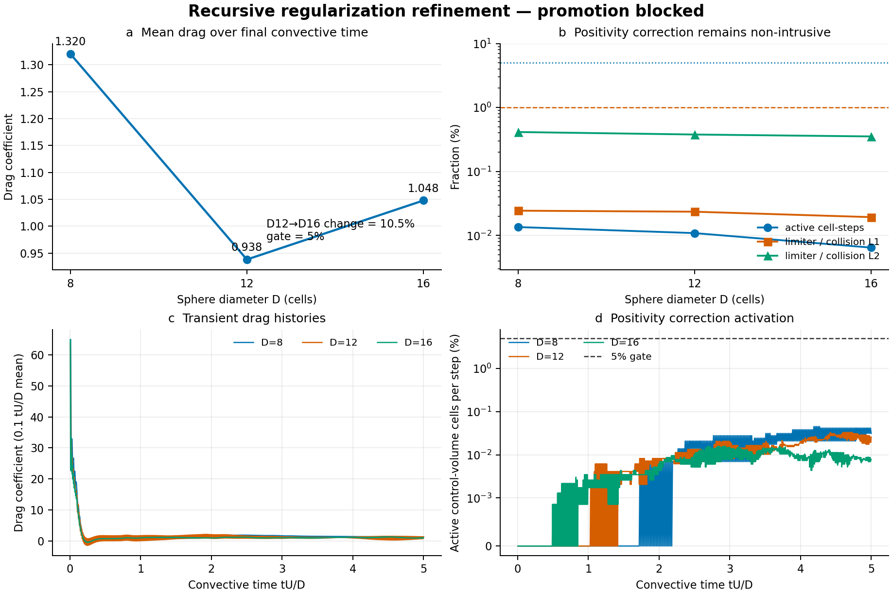
  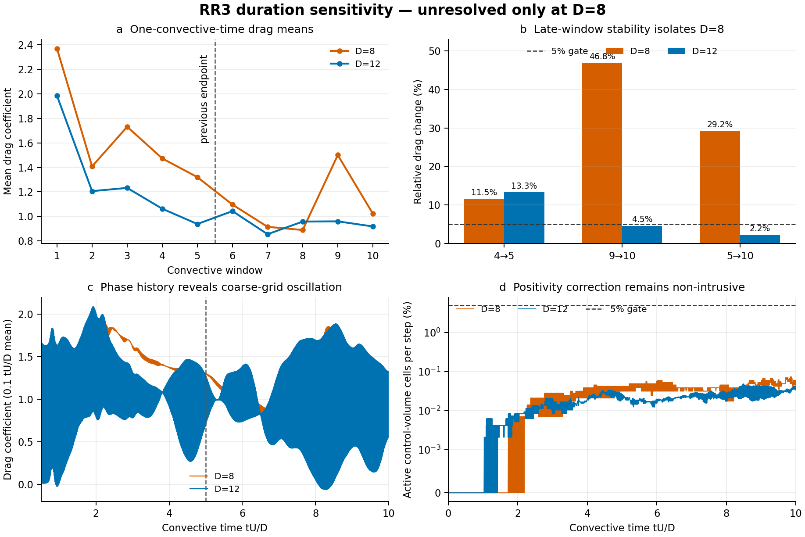
</p>

Recursive-regularized BGK keeps the D=8/12/16 stationary-sphere cases positive, source/force closed, and non-intrusive while correction decreases with refinement. Promotion is still blocked: `Cd = 1.32042, 0.93800, 1.04777` is non-monotonic and the D12→D16 change is `10.476%` against the unchanged `5%` gate.

The cheap ten-convective-time follow-up resolved half the ambiguity:

- D=12 is late-window stable: ninth→tenth change `4.543%`; fifth→tenth change `2.177%`.
- D=8 is not: ninth→tenth change `46.848%`; fifth→tenth change `29.219%`.
- Every positivity, conservation, force-budget, control-isolation, and correction gate still passes.

Therefore the next highest-ROI experiment is **D=8 only**: estimate its dominant shedding period, then report period-complete block means and uncertainty. That is more defensible—and far cheaper—than spending immediately on D=20 or treating adjacent one-convective-time windows as independent steady estimates.

## The force-accounting investigation

The prescribed-wing load error was once roughly fivefold. The repository now contains the full chain that found and corrected it:

1. **Load decomposition** showed cover/uncover topology impulse contributed only `0.47%` of mean lift and `2.90%` of mean drag; link exchange dominated.
2. **Conventional versus Galilean-invariant momentum exchange** changed mean loads by less than `1%`, ruling out the wall-frame correction as the main factor.
3. **Independent coefficient reconstruction** recovered the paper denominator exactly from equations and raw forces, ruling out a shared normalization multiplier.
4. **Link-numerator decomposition** localized the sensitivity to cancellation between reflected populations and moving-wall correction.
5. **Near-wing fluid momentum balance** gave `(CL, CD)=(1.18092, 2.04933)` while legacy boundary accumulation gave approximately `(7.51, 9.56)`.
6. **A conservative moving-domain estimator** closed that independent balance within `0.002511/0.000247` maximum phase residuals under a `0.005` gate.
7. **A translating-sphere topology canonical** improved RMS momentum closure by `22,020×` over the retired estimator and made the corrected estimator the production default.
8. **The promoted 20/24-cell flapping ladder** then passed mean-load, phase, symmetry, periodicity, vortex, batching, and grid-change gates without relaxing thresholds.

This sequence is summarized in [`Docs/VALIDATION.md`](Docs/VALIDATION.md); machine-readable ledgers live in [`ValidationArtifacts/`](ValidationArtifacts/).

## Architecture

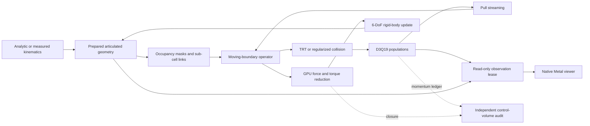
```mermaid
flowchart LR
    K["Analytic or measured kinematics"] --> G["Prepared articulated geometry"]
    G --> M["Occupancy masks and sub-cell links"]
    P["D3Q19 populations"] --> S["Pull streaming"]
    M --> B["Moving-boundary operator"]
    S --> B
    B --> C["TRT or regularized collision"]
    C --> P
    B --> R["GPU force and torque reduction"]
    R --> D["6-DoF rigid-body update"]
    D --> G
    P --> O["Read-only observation lease"]
    G --> O
    O --> V["Native Metal viewer"]
    P -. "momentum ledger" .-> A["Independent control-volume audit"]
    R -. "closure" .-> A
```

The package is an original implementation. Its software organization adopts PyFR’s controller/resource/command-graph separation: physical types and reference algebra are isolated from Metal resource orchestration, pipeline states are compiled once per backend, and a fixed GPU command graph is encoded repeatedly. The numerical operators themselves are Metal-specific MSL.

### Per-step coupled path

```text
prepare articulated pose and physical wall velocity
update current and previous solid occupancy
pull-stream 19 populations per fluid cell
apply interpolated moving-boundary reconstruction
recover density, velocity, and isothermal pressure
apply TRT or selected regularized collision + far-field sponge
accumulate link exchange and cover/uncover momentum
reduce force and torque deterministically on the GPU
optionally integrate the rigid torso and orientation
publish a read-only field lease when visualization requests one
```

Newly uncovered nodes are refilled from a local moving-boundary equilibrium. Newly covered nodes contribute their population momentum conversion to the body load. Demonstration and schema-1 prescribed wings remain explicitly massless. Schema 2 instead requires bilateral measured wing mass properties; the GPU applies their phase-resolved internal-momentum reaction to the body and archives left/right hinge reactions.

## Metal engineering

The production path is structured for Apple unified memory and predictable command submission:

- direction-major population storage gives adjacent GPU threads adjacent cell access;
- articulated wing frames are prepared once per timestep rather than once per cell;
- conservative bounds cull expensive bird geometry work;
- measured periodic keyframes are sampled once per timestep with physical rates preserved;
- occupancy and part identity share compact byte masks;
- the first deterministic load reduction is fused into fluid threadgroups;
- prescribed-wing phase loads reduce into a compact cycle buffer without per-step CPU waits;
- sub-cell boundary fractions reuse dormant solid-node population slots instead of allocating a full-grid link buffer;
- command-buffer batches are queued without intermediate CPU waits;
- density and velocity are captured only for the final externally visible step;
- fixed cases skip unused body-integration and intermediate load work; and
- allocation preflight rejects grids exceeding per-buffer or recommended working-set limits before partial allocation.

Optimization is accepted only when numerical state, loads, body state, and validation thresholds remain unchanged. [`Docs/BUILD_REPORT.md`](Docs/BUILD_REPORT.md) records the exact verification boundary and measured host timings.

## Native Metal viewer

```bash
swift run -c release birdflow-viewer
```

The same-process macOS viewer includes:

- pressure or `Cp` on the articulated body;
- arbitrary oblique slices with velocity, normal velocity, or vorticity;
- live world/velocity/vorticity probes and in-plane glyphs;
- RK2 pathlines with CFL subdivision and discontinuity reset;
- physical-unit vorticity and Q criterion;
- GPU classic marching cubes with capacity-safe indirect drawing;
- force, torque, body pose, solver time, render time, dropped-frame, and Q-capacity HUDs;
- versioned run bundles, derived-field keyframes, and exact compressed solver checkpoints.

Visualization receives only completed read-only field leases. Three best-effort slots prevent rendering from waiting the solver; if all slots are busy, the frame is dropped. The standalone compact M4 benchmark recorded `751.4 step/s` without observation and `643.2 step/s` with active offscreen rendering—`14.4%` ordinary GPU contention, zero visualization solver waits, and zero dropped frames.

Regenerate the hero GIF locally:

```bash
./Scripts/capture-readme-gif.sh
```

Every prior published hero is preserved byte-for-byte in the
[`Docs/Media/Progress`](Docs/Media/Progress/README.md) archive, so visual polish
does not erase the project's development history.

See [`Docs/VIEWER.md`](Docs/VIEWER.md) for controls, persistence formats, numerical separation, and verification.

## Quick start

### Requirements

- Apple-silicon Mac
- macOS 14 or later
- Xcode command-line tools with Metal compiler support
- Swift 6 or later
- Python 3 with NumPy and Matplotlib for reference/audit plots

### Build and run the local gates

```bash
swift build -c release
swift test -c release
./Scripts/check-metal.sh
python3 Scripts/static-audit.py
./Scripts/validate.sh
```

`check-metal.sh` invokes Apple’s offline compiler on both Metal libraries. `validate.sh` adds the independent reference cases and core production-Metal canonicals. Expensive flapping and high-Re refinement ladders remain explicit commands rather than surprise work inside every local check.

> [!NOTE]
> Validation is local-only. There are intentionally no GitHub Actions workflows, so pushes and pull requests do not consume hosted macOS CI minutes.

Latest recorded local run on Apple M4 (2026-07-17): **125 release tests passed in 945.672 seconds** (`946.19 s` command wall time). The complete local validation gate also retains its prior 125-test debug pass in 1058.650 seconds, independent physical-condition verifier, static Swift/MSL layout audit, offline compilation of both Metal libraries, and moving-wall, translating-body, fixed-sphere, and fixed-wing production-Metal canonicals.

## Run the solver

Fixed bird in an incoming stream:

```bash
swift run -c release birdflow \
  --steps 4096 \
  --report-every 128 \
  --reynolds 2000 \
  --reference-speed 8 \
  --lattice-speed 0.04
```

Free flight in initially stationary air:

```bash
swift run -c release birdflow \
  --free-flight \
  --steps 4096 \
  --report-every 128
```

Physical-domain-preserving refinement:

```bash
swift run -c release birdflow \
  --resolution-scale 2 \
  --steps 8192 \
  --report-every 256
```

`--resolution-scale N` multiplies grid dimensions, chord resolution, and sponge width by `N`, reducing `dx` and `dt` by `N`. Multiply the step count by `N` to compare the same physical duration. The executable emits CSV with time, body pose, linear velocity, aerodynamic force, and aerodynamic torque.

## Canonical validation commands

```bash
# Periodic shear-wave decay and convergence
swift run -c release birdflow validate shear-wave --resolution 32 --json

# Couette + oscillating Stokes moving walls
swift run -c release birdflow validate moving-wall --resolution 32 --json

# Topology-changing translating sphere and momentum closure
swift run -c release birdflow validate translating-body --json

# Re=100 fixed sphere
swift run -c release birdflow validate sphere --resolution 160 --json

# Re=100 aspect-ratio-2 fixed finite wing
swift run -c release birdflow validate wing --resolution 400 --json

# Published prescribed-wing input/geometry audit
swift run birdflow validate flapping-wing --audit-inputs --chord-cells 16 --json

# Published prescribed-wing production solve
swift run -c release birdflow validate flapping-wing --chord-cells 16 --json

# Current high-Re RR3 coarse-grid duration diagnostic
.build/release/birdflow validate translating-body \
  --high-re-stability --fixed-occupancy --stationary-wall \
  --recursive-regularization-duration --json
```

The fixed sphere and fixed wing are compact engineering canonicals, not substitutes for publication-scale domain and resolution studies. The accepted prescribed-wing composite is independently audited by:

```bash
python3 Scripts/audit-flapping-refinement.py
python3 Scripts/verify-measured-wing-physical-condition.py
```

## Measured geometry and kinematics

Audit a specimen input without allocating Metal resources:

```bash
.build/release/birdflow replay measured-bird \
  --input /path/to/specimen.json \
  --chord-cells 12 \
  --audit-only \
  --json
```

Replay prescribed motion and retain exact-input provenance plus phase loads:

```bash
.build/release/birdflow replay measured-bird \
  --input /path/to/specimen.json \
  --chord-cells 12 \
  --cycles 5 \
  --archive /path/to/specimen-replay-c12 \
  --json
```

Schema 1 requires SI units, source provenance, a COM-centered principal-axis frame, domain conditions, morphometrics, and independent left/right periodic pose and rate histories. Schema 2 adds measured bilateral wing mass, hinge-relative COM, inertia, and explicit whole-bird mass definitions for free flight. Cubic-Hermite interpolation keeps pose and wall velocity consistent. Preflight rejects invalid phase coverage, domain/sponge collisions, under-resolved thickness, and excessive estimated lattice Mach before Metal allocation.

The bundled complete-bird JSON is a **synthetic conformance fixture**, not a measured specimen. The measured right-wing surface tier is also intentionally wing-only. Read [`Docs/MEASURED_BIRD_DATA.md`](Docs/MEASURED_BIRD_DATA.md) before interpreting any replay.

For a same-specimen schema-2 input, `--load-refinement` runs the locked
five-cycle `8/12/16` load ladder and `--body-refinement --steps N` runs the
same-fluid `1/2/4` body-substep ladder. Free flight records bilateral inertial
hinge reactions and aborts on the first GPU-recorded Mach, clearance, or
non-finite-state event. Add `--momentum-ledger` to a free-flight replay to
archive direct population/body/wing momentum, far-field and sponge sources,
gravity, persistent-link exchange, inferred topology conversion, and both
locked `0.5%` closure gates. `--part-loads` additionally makes that intent
explicit and archives conservative body/left-wing/right-wing/tail loads,
aerodynamic hinge torque, prescribed-wing inertial reaction, required actuator
torque, and signed mechanical power:

```bash
.build/release/birdflow replay measured-bird \
  --input /path/to/schema-2-specimen.json \
  --chord-cells 12 --steps 100 --body-substeps 4 \
  --part-loads --archive /path/to/free-flight-ledger --json
```

For deliberately symmetric input, add `--expect-bilateral-symmetry` to apply
the locked `2%` mirrored force, hinge-torque, and actuator-power gate. It is
opt-in because measured left/right asymmetry can be physical.

For a schema-2 forward-flight specimen with nonzero freestream,
`--trim-search` performs a bounded body-pitch/airspeed Gauss-Newton search. It
uses two-cycle candidates at the requested screening grid, then reruns only the
selected point for at least five cycles before applying the unchanged `5%`
force, moment, and stationarity gates:

```bash
.build/release/birdflow replay measured-bird \
  --input /path/to/schema-2-specimen.json \
  --chord-cells 8 --trim-search --trim-iterations 2 \
  --archive /path/to/trim-search --json
```

The archive retains the byte-identical base input, every candidate result, and
the exact derived best-candidate JSON. Speed and Reynolds number scale together
so physical viscosity is unchanged; measured geometry and wing kinematics are
never tuned. A passing prescribed trim search is still not free-flight
boundedness or grid/body-step acceptance. Hover trim is rejected until the
input declares a physical aerodynamic control variable.

Use that archive's exact selected input for the combined confirmation gate:

```bash
.build/release/birdflow replay measured-bird \
  --input /path/to/trim-search/best-candidate-input.json \
  --chord-cells 8 --free-flight-confirmation \
  --archive /path/to/free-flight-confirmation --json
```

The command starts three independent experiments from the same input: a
minimum five-cycle, four-body-substep free-flight trajectory; a one-cycle
`1/2/4` body-step ladder; and a one-cycle coupled momentum/per-part load audit.
The trajectory must remain within `0.10` chord position drift, `0.05` reference
speed, `5 deg` attitude change, and `0.05` cycle-scaled angular velocity while
also passing runtime, refinement, `0.5%` momentum, and `0.5%` part-sum gates.
Its atomic archive includes the byte-identical input, trajectory CSV, and every
nested report. These are solver boundedness thresholds, not a universal claim
about biological maneuver amplitude or passive stability.

The diagnostic is opt-in and lazily allocates only compact reduction buffers;
normal batched solver/viewer throughput is unchanged. The current missing-data decision is retained in
[`ValidationArtifacts/quantitative-complete-bird-readiness.json`](ValidationArtifacts/quantitative-complete-bird-readiness.json).

## Scientific boundary

BirdFlowMetal targets low-Mach flapping flight and wakes using an isothermal weakly compressible formulation, a uniform Cartesian grid, rigid surfaces, moving occupancy masks, and sub-cell link placement in the prescribed beta-wing benchmark.

Quantitative complete-bird claims still require:

- an actual measured specimen with body, both wings, tail, mass properties, geometry provenance, and synchronized kinematics;
- a surface representation appropriate to the measured feather/wing geometry;
- passing the five-cycle `8/12/16` measured-bird load ladder;
- a passing five-cycle-confirmed prescribed trim search at the declared flight
  condition, followed by the archived `--free-flight-confirmation` gate;
- a passing archived per-part load/actuator report on that specimen, with the
  bilateral symmetry gate enabled only when its input is intentionally
  symmetric;
- a confirmation trajectory that stays inside the declared boundedness and
  per-step Mach/sponge/domain abort bounds, plus its independently restarted
  coupled-momentum/per-part and `1/2/4` rigid-body substep runs;
- same-specimen schema-2 wing inertia and a passing archived hinge-reaction
  treatment (or a separately justified massless-wing scientific model);
- forced channel-flow coverage and any turbulence/flexibility model required by the target regime.

The high-Re stationary-sphere RR3 branch is a collision-operator research gate. It is **not enabled** in flapping or measured-bird replay while its force statistic is unresolved. The accepted prescribed flapping benchmark validates the production moving-boundary/load path; it does not magically validate arbitrary complete-bird morphology or free-flight physics.

## Repository map

```text
Sources/BirdFlowCore/
  D3Q19.swift                       lattice and host reference algebra
  SimulationConfiguration.swift    physical/lattice scaling and guards
  BirdModel.swift                   morphology and articulated kinematics
  RigidBody.swift                   six-degree-of-freedom CPU reference

Sources/BirdFlowMetal/
  BirdFlowSimulation.swift          GPU state and command graph
  MetalBackend.swift                device, pipelines, resource setup
  Metal*Validation.swift            production-kernel canonical harnesses
  GPUData.swift                     Swift/MSL-compatible layouts
  Metal/BirdFlow.metal              fluid, boundary, reduction, body kernels

Sources/BirdFlowVisualization/
  ...                               read-only field diagnostics and renderer
  Metal/Visualization.metal         Q, slices, pathlines, marching cubes

Sources/BirdFlowViewerApp/           native SwiftUI/MetalKit macOS viewer
Reference/                           independent numerical references
Scripts/                             local audits, plotting, capture, gates
ValidationArtifacts/                exact machine-readable scientific record
ValidationInputs/                   locked input fixtures and provenance
Docs/                                numerics, validation, viewer, data contract
```

Start with [`Docs/NUMERICS.md`](Docs/NUMERICS.md) for equations, [`Docs/VALIDATION.md`](Docs/VALIDATION.md) for acceptance logic, and [`Docs/BUILD_REPORT.md`](Docs/BUILD_REPORT.md) for what has actually been verified.

## Published anchors and data qualification

- Fixed-wing comparison: [Taira and Colonius, *Journal of Fluid Mechanics* (2009)](https://authors.library.caltech.edu/records/frnmk-28536).
- Measured hummingbird right-wing surface: [Maeda et al., *Royal Society Open Science* (2017), DOI 10.1098/rsos.170307](https://doi.org/10.1098/rsos.170307), deposited grid [DOI 10.6084/m9.figshare.5406124.v1](https://doi.org/10.6084/m9.figshare.5406124.v1), CC BY 4.0.
- Prescribed numerical comparison: [Dong et al., *Insects* (2022), DOI 10.3390/insects13050459](https://doi.org/10.3390/insects13050459).
- Synchronized dove geometry/kinematics/force candidate: [Deetjen et al., *eLife* (2024), DOI 10.7554/eLife.89968](https://doi.org/10.7554/eLife.89968), deposited data [DOI 10.5061/dryad.wwpzgmsqs](https://doi.org/10.5061/dryad.wwpzgmsqs), CC0 1.0.
- The checked Song et al. Dryad archive [DOI 10.5061/dryad.8ch1b](https://doi.org/10.5061/dryad.8ch1b) is retained only as reference-curve material; it does not contain a complete reconstructed bird mesh.

[`measured-wing-source-audit.json`](ValidationArtifacts/measured-wing-source-audit.json) locks source filenames, licenses, MD5/SHA-256 digests, coordinate registration, scale reconstruction, surface-area closure, and the fields still missing for complete-bird replay.
The follow-up [`same-specimen source-gap audit`](ValidationArtifacts/maeda-same-specimen-source-gap-audit.json)
enumerates the complete public Maeda collection and separates potentially
recoverable author/zoo records from measurements that likely require a new
campaign. A concise, ready-to-send availability inquiry is in
[`Docs/SAME_SPECIMEN_DATA_REQUEST.md`](Docs/SAME_SPECIMEN_DATA_REQUEST.md).
The independent
[`Deetjen dove source qualification`](ValidationArtifacts/deetjen-dove-source-qualification.json)
selects one bounded prescribed-force benchmark, locks its remote Zip64 members,
and separates measured force channels from modeled lateral force and inertia.
The follow-up
[`engineering ingestion audit`](ValidationArtifacts/deetjen-dove-engineering-ingestion.json)
CRC/SHA-verifies the selectively acquired nine-member flight, reconstructs the
1000/2000 Hz synchronization, and inventories the real body/wing/tail surfaces.
The follow-up force-registration artifact locks the two deposited processing
scripts, the exact 287-sample BirdFlow force target, and the explicit
unavailable lateral component. The coarse pilot then localizes a near-wall
population-stability failure before the comparison window; experimental CFD
agreement remains open.

## Reproducibility and citation

Validation artifacts are versioned JSON, figures are generated from those artifacts, and source-lock chains make stale provenance detectable. For academic discussion before a formal release DOI exists, cite the repository URL plus an immutable Git commit and name the exact artifact used. Do not cite a screenshot, GIF, branch name, or unarchived console result as quantitative evidence.

## License

BSD-3-Clause. See [`LICENSE`](LICENSE).
